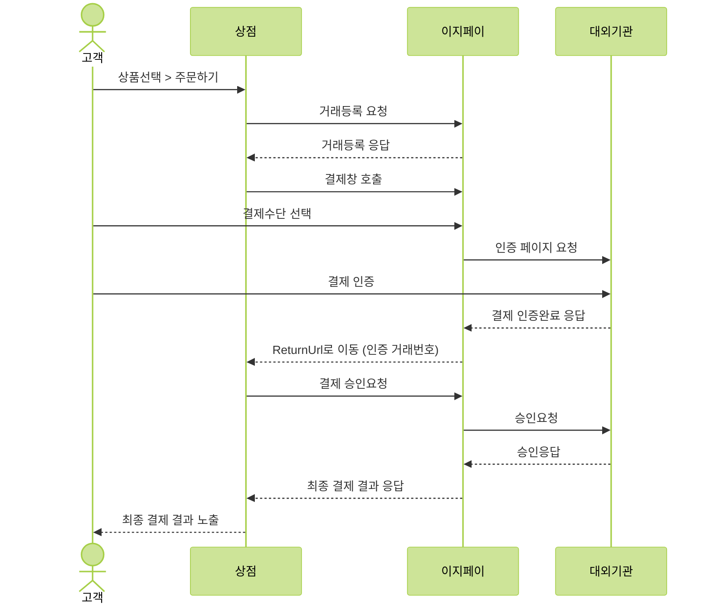
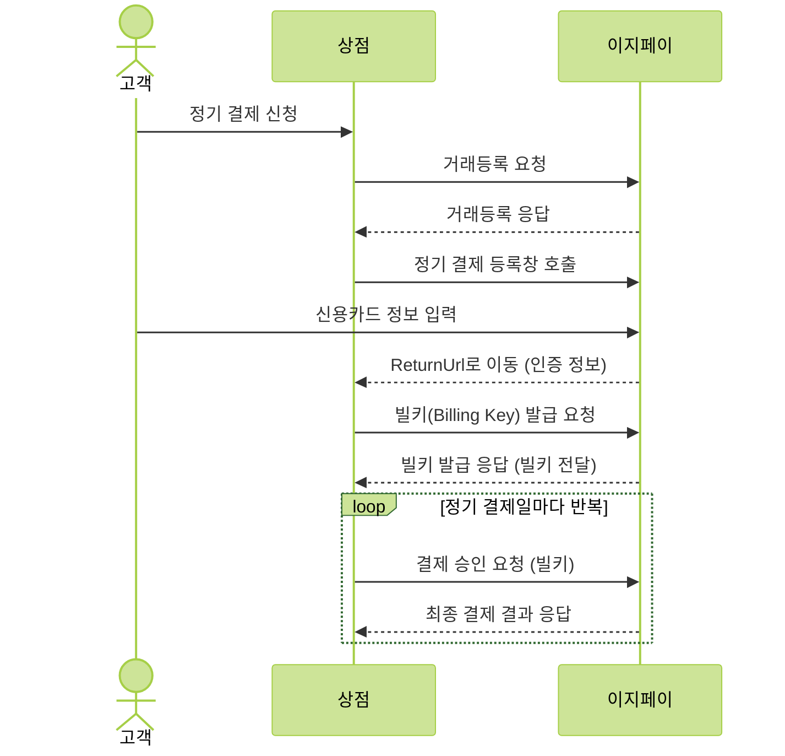
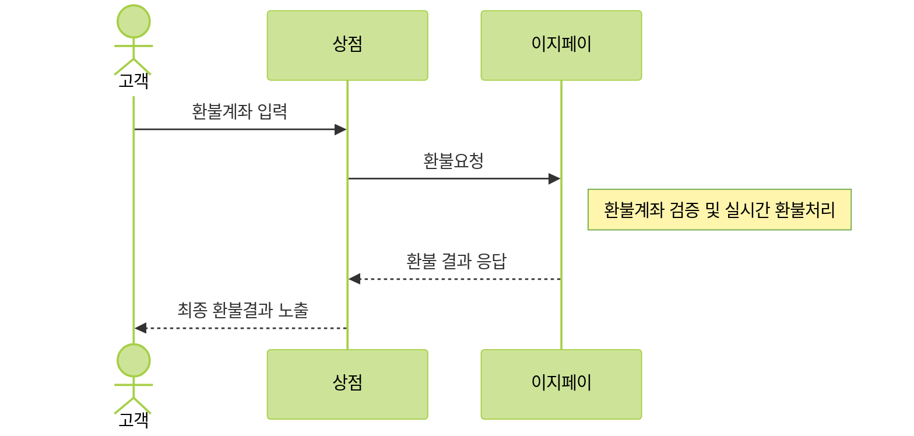
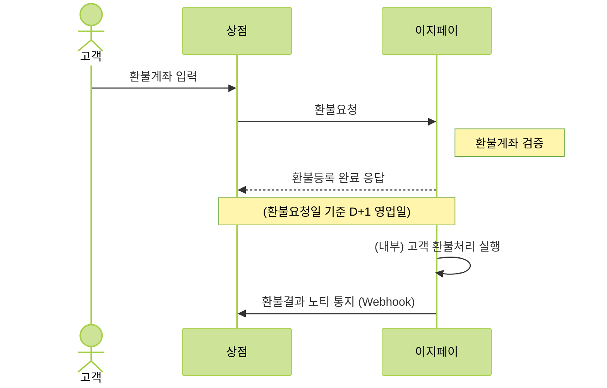
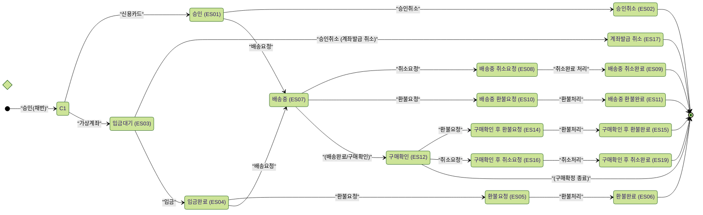
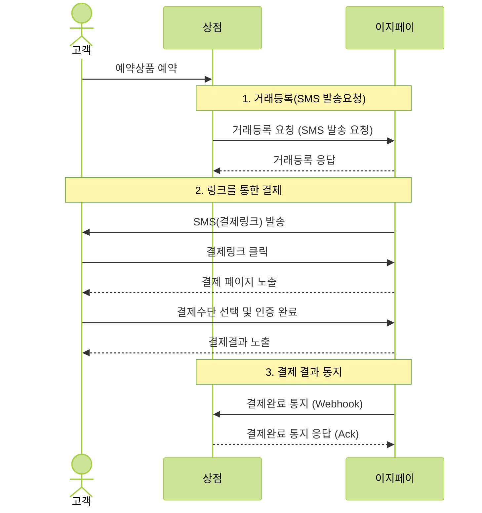

# KICC Online Payment Developer Documentation (Full Context)
# Generated based on: static/online/llms.txt
# Date: 2026-01-29T06:30:41.725Z
# This file contains selected documentation for Online Payment services.

--------------------------------------------------------------------------------

================================================================================
Title: API 도메인
Source: http://docs.kicc.co.kr/docs/online-payment/common/api-domain.md
================================================================================

이지페이 온라인 결제 API 서버 도메인은 다음과 같습니다.
* 개발 서버 : **testpgapi.easypay.co.kr**
* 운영 서버 : **pgapi.easypay.co.kr**

:::warning 주의사항
API 호출 시 반드시 **HTTPS**로 호출하시기 바랍니다.    
:::


================================================================================
Title: 방화벽
Source: http://docs.kicc.co.kr/docs/online-payment/common/security.md
================================================================================

상점은 KICC 서버로 나가는 아웃바운드 트래픽에 대해 다음과 같이 상점 서버의 방화벽을 설정하시기 바랍니다.

:::info 방화벽 가이드
**허용 포트 : TCP 443**  
허용 도메인 : 백엔드 API 서버 도메인    
:::

#### 노티(웹훅) 서비스 방화벽
[노티(웹훅) 서비스](/docs/online-payment/services/webhook)를 사용하는 상점의 경우 인바운드 트래픽에 대해 다음과 같이 상점 서버의 방화벽을 설정하시기 바랍니다.
<table>
  <thead>
    <tr>
      <th>구분</th>
      <th>출발지IP</th>
      <th>설명</th>
    </tr>
  </thead>
  <tbody>
    <tr>
      <td rowspan="3">운영</td>
      <td>203.233.72.150</td>
      <td>INBOUND</td>
    </tr>
    <tr>
      <td>203.233.72.151</td>
      <td>INBOUND</td>
    </tr>
    <tr>
      <td>61.33.211.180</td>
      <td>INBOUND</td>
    </tr>
    <tr>
      <td>개발</td>
      <td>61.33.205.151</td>
      <td>INBOUND</td>
    </tr>
  </tbody>
</table>
 
### TLS/SSL 지원  
이지페이 온라인 결제 API는 TLS 1.2를 지원합니다. SSL은 더 이상 지원하지 않으므로 TLS 1.2를 지원하는 클라이언트 라이브러리를 사용해야 합니다.


================================================================================
Title: 오류 처리
Source: http://docs.kicc.co.kr/docs/online-payment/common/exception-handling
================================================================================

## HTTP Status Code Summary
이지페이에서 제공하는 API 응답으로 전달되는 HTTP Status Code는 다음과 같습니다.

| **Code** | **설명** |
| :---: | :--- |
| **200** | OK, 요청이 성공적으로 처리되었습니다. |
| 4XX | Bad Request, 잘못된 요청입니다. |
| 5XX | Server Errors, 이지페이 서버에 오류가 있는 경우입니다. |

## 응답 형식
HTTP Status Code가 200일 경우만 API 요청에 대한 응답코드, 응답 메시지가 전송됩니다.
이지페이 온라인 결제 API의 기본 응답 형식은 다음과 같습니다.

```json title="응답 body 예"
{
    "resCd" : "0000",
    "resMsg" : "성공",
}
```
### 응답 필드
| **필드명** | **타입** | **필수여부** | **설명** |
| :--- | :---: | :---: | :--- |
| resCd | string | ✅ | 응답 코드 |
| resMsg | string | ✅ | 응답 메시지 |

### 응답 코드
결제 실패에 대한 응답코드와 응답 메시지는 서비스 업데이트 시 변경될 수 있습니다.
| **코드값** | **타입** | **설명** |
| :--- | :---: | :--- |
| 0000 | String | 성공 |
| XXXX | String | 결제실패 사유('0000' 제외) |


================================================================================
Title: API 멱등성
Source: http://docs.kicc.co.kr/docs/online-payment/common/idempotency.md
================================================================================

이지페이 온라인 결제 API는 클라이언트가 동일한 요청을 반복 전송하더라도 서버에서 **중복 처리를 방지하기 위해 멱등성 키(Idempotency Key)를 지원**합니다.

클라이언트는 요청 시 데이터 필드(상점 거래고유번호)에 멱등성 키를 포함하여 전송해야 합니다.
멱등성 키는 **요청당 고유한 키 값(UUID 또는 랜덤 문자열)이어야 하며, 동일 키로 재요청 시 서버는 중복 요청 오류응답**을 반환합니다.

API 요청 시 유니크한 멱등성 키를 생성하여 아래와 같이 요청/응답 데이터(상점 거래고유번호)에 입력합니다. 요청 시 전달한 멱등성 키는 응답 시 그대로 전달 받을 수 있습니다.

```json title="요청/응답 Body 예"
{
    "shopTransactionId": "{Idempotency Key}",
}
```
:::warning 멱등성 키(Idempotency Key)
* 멱등성 키(Idempotency Key)는 클라이언트가 직접 생성, 관리해야 하며 요청마다 고유해야 합니다.  
* 키 유효 시간은 요청 당일 자정까지 유효하며, 이 기간 내 동일 키 재요청 시 중복 오류가 발생할 수 있습니다.  
* 키가 다르면 같은 내용의 요청이라도 다른 요청으로 간주되니 주의해야 합니다.
:::

## API 멱등성 키 생성
| **언어** | **추천 함수** |
| :--- | :--- |
| Java    | [`UUID.randomUUID`](http://docs.oracle.com/javase/7/docs/api/java/util/UUID.html) |
| Python  | uuid ([`Python 2`](https://docs.python.org/2/library/uuid.html), [`Python 3`](https://docs.python.org/3.1/library/uuid.html)) |
| PHP     | [`uniqid`](http://php.net/manual/en/function.uniqid.php) |
| C#      | [`Guid.NewGuid`](https://learn.microsoft.com/en-us/dotnet/api/system.guid.newguid?redirectedfrom=MSDN\&view=net-7.0#System_Guid_NewGuid) |
| Ruby    | [`SecureRandom.uuid`](https://ruby-doc.org/stdlib-2.5.0/libdoc/securerandom/rdoc/Random/Formatter.html#method-i-uuid)  |
| Node.js | [`uuid`](https://www.npmjs.com/package/uuid) |


================================================================================
Title: 응답 형식
Source: http://docs.kicc.co.kr/docs/online-payment/common/response-format.md
================================================================================

# 응답 형식
이지페이 온라인 결제 API의 기본 응답 형식은 다음과 같습니다.

```json title="응답 body 예"
{
    "resCd" : "0000",
    "resMsg" : "성공",
}
```
### 응답 필드
| **필드명** | **타입** | **필수여부** | **설명** |
| :--- | :---: | :---: | :--- |
| resCd | string | ✅ | 응답 코드 |
| resMsg | string | ✅ | 응답 메시지 |

#### 응답 코드
| **코드값** | **타입** | **설명** |
| :--- | :---: | :--- |
| 0000 | String | 성공 |
| XXXX | String | 결제실패 사유('0000' 제외) |


================================================================================
Title: 특수문자 제한
Source: http://docs.kicc.co.kr/docs/online-payment/common/special-character.md
================================================================================

API 요청 시 시스템 안정성과 보안을 위해 특정 특수문자의 사용이 제한됩니다.
API 연동 시 아래 규칙을 준수하여 파라미터를 전송해 주시기 바랍니다.

## 🚫 사용 금지 특수문자

아래 특수문자들은 데이터 처리 과정에서 시스템 오류를 유발하거나 보안 위협(SQL Injection, XSS 등)이 될 수 있어 **입력이 차단**됩니다.

| 문자 | 명칭 | 제한 사유 | 대체 방안 |
| :---: | :--- | :--- | :--- |
| `'` | Single Quote | SQL Injection 위험 | 제거 또는 전각 문자 사용 |
| `"` | Double Quote | JSON 파싱 오류 유발 | 제거 |
| `<` `>` | Angle Brackets | XSS(Cross Site Scripting) 위험 | 제거 |
| `\` | Backslash | 이스케이프 문자 혼동 및 JSON 파싱 오류 | 제거 (`/`로 대체) |
| `;` | Semicolon | SQL Injection (쿼리 분리/종료) 위험 | 제거 |
| `\|` | Vertical Bar (Pipe) | Command Injection 및 내부 구분자 충돌 | 쉼표(`,`) 등으로 대체 |
| `\n` `\r` | Newline (CR/LF) | HTTP Response Splitting, 로그 위조(Log Forging) | 공백으로 치환 또는 제거 |
| `&` | Ampersand | URL 파라미터 구분자 혼동 | URL Encoding (`%26`) 처리 |


:::warning 주의사항
이모지(Emoji, 예: 🍎, 😊)는 4바이트 문자로, 일부 레거시 시스템(EUC-KR 기반)이나 데이터베이스에서 저장이 불가능하거나 깨짐 현상이 발생할 수 있어 사용을 **엄격히 제한**합니다.
:::

<br />

## ✅ 필드별 허용 문자

각 파라미터의 성격에 따라 허용되는 문자 범위가 다릅니다.

### 1. 주문번호 (orderId)
가맹점에서 생성하는 고유한 주문 식별값입니다.
* **허용:** 영문 대소문자(`A-Z`, `a-z`), 숫자(`0-9`), 하이픈(`-`), 언더바(`_`)
* **길이:** 최대 40자
* **예시:** `ORD-20231025-0001`

### 2. 상품명 (goodName)
* **허용:** 한글, 영문, 숫자, 공백, 기본 문장 부호(`(`, `)`, `[`, `]`, `-`, `.`)
* **제한:** 위 '사용 금지 특수문자'에 포함된 기호
* **예시:** `[특가] 가을 신상 자켓 (Black)`

### 3. 구매자명 / 이메일
* **구매자명:** 한글, 영문, 공백 허용 (특수문자 불가)
* **이메일:** 이메일 표준 형식(`@`, `.`, `_`, `-` 허용)


================================================================================
Title: 하위 호환성
Source: http://docs.kicc.co.kr/docs/online-payment/common/compatibility.md
================================================================================

이지페이 API 서비스는 하위 호환성 준수 변경에 대해서는 제공되는 API의 버전 변경 없이 진행됩니다. 하위 호환성 미준수 변경에 대해서는 새롭게 릴리즈 하거나, 신규 URI를 통해 제공 됩니다.

**하위 호환성 준수 변경기준**

* 신규 API 엔드포인트 추가
* API 요청에 새로운 선택 파라미터 추가
* API 요청에서 필수 파라미터를 선택 파라미터로 변경
* API 응답에 새로운 파라미터 추가
* 새로운 Enum Value 추가
* 새로운 오류 코드 추가 및 오류 메시지 변경

**하위 호환성 비준수 변경기준**

* API 엔드포인트 제거
* API 요청에 새로운 필수 파라미터 추가
* API 요청에서 선택 파라미터를 필수 파라미터로 변경
* API 응답에 사용 필수 파라미터 삭제
* API 요청 및 응답 항목의 데이터 타입 변경

**클라이언트 하위 호환성 설정 가이드**

Java의 예를 들어 설명하면, Jackson의 경우 ObjectMapper를 선언해서 사용하면 default 옵션이 기본적으로 켜져 있기 때문에 필드가 추가되었을 때 이를 처리하지 못합니다.

이지페이 API의 필드 추가 등의 변경으로 인하여 영향을 발생하지 않도록 아래와 같은 설정이 필요 합니다.
```java title="Java Object Mapper 설정"
// jackson 1.9 and before
objectMapper.configure(DeserializationConfig.Feature.FAIL_ON_UNKNOWN_PROPERTIES, false);
// or jackson 2.0
objectMapper.configure(DeserializationFeature.FAIL_ON_UNKNOWN_PROPERTIES, false);
```


================================================================================
Title: 변경 이력
Source: http://docs.kicc.co.kr/docs/online-payment/common/changelog.md
================================================================================

# 온라인 결제 변경 이력

Easypay 온라인 결제 API의 최신 변경 사항입니다.

---

| **일자** | **요약** |
| :--- | :--- |
| 2025.12.27 | 기존 연동 가이드 리뉴얼 |
| 2024.08.08 | 결제승인 응답 시 결제수단 승인번호 최대 사이즈 변경( 50 👉 100Byte) |
| 2023.03.27 | 기존 연동 가이드 리뉴얼 |


================================================================================
Title: 개요
Source: http://docs.kicc.co.kr/docs/online-payment/general/introduction.md
================================================================================

이지페이 일반 결제 서비스는 고객이 상점을 통해 주문을 하고, 결제창을 통해 결제기관(대외기관) 인증 후 결제를 할 수 있는 서비스 입니다.  
이지페이는 두 가지 유형의 결제 서비스를 제공하고 있습니다. 주문을 하면 바로 카드사(간편결제사 포함) 결제창을 호출하는 방법과 이지페이 결제창에서 카드사(간편결제사 포함)를 호출하는 방법이 있습니다.

:::info 참고
* **통합형 결제창**: 이지페이 결제창을 통해 대외기관(카드사, 간편결제사 등)를 호출하는 방식
  + 신용카드, 간편결제, 가상계좌, 계좌이체, 휴대폰 결제, 포인트 결제 서비스를 지원합니다.
  + 신용카드 결제 시 별도의 조회없이 무이자 또는 즉시할인 서비스가 가능합니다..
* **단독형 결제창**: 대외기관(카드사, 간편결제사 등)을 직접호출하는 방식
  + 신용카드, 간편결제, 계좌이체, 휴대폰결제 서비스를 직접호출할 수 있도록 지원합니다.
  + 신용카드 결제 시 무이자 조회 API 와  즉시할인 조회 API가 별도 제공됩니다.
:::

아래와 같은 결제 흐름으로 서비스가 진행됩니다.

<div style={{ marginBottom: '24px' }}>

</div>

고객이 결제창에서 결제를 진행하면 상점의 returnUrl로 이동하면서 **인증 거래번호**가 전달됩니다.  
상점은 **인증 거래번호**로 이지페이에 결제 승인요청을 하게 됩니다.
결제 승인이 완료되면 결과 응답을 받아 최종 결제 결과를 확인하시면 됩니다.

:::warning 주의사항
* 다중정산 서비스를 이용하기 위해서 **다중정산 전용 상점ID**를 발급 받아야 합니다.
:::


================================================================================
Title: 일반결제 통합형 거래등록
Source: http://docs.kicc.co.kr/docs/online-payment/general/integration/register-tx.md
================================================================================

결제 화면 호출을 하기 위해 주문정보를 등록하면 **결제창 호출 URL**을 응답으로 받을 수 있습니다.  

## 요청
```bash title="요청 URL"
POST https://{API 도메인}/api/ep9/trades/webpay
Content-type: application/json; charset=utf-8
```
### 파라미터
| **필드명** | **타입** | **길이** | **필수여부** | **설명** |
| :--- | :---: | ---: | :---: | :--- |
| mallId | String | 8Byte | ✅ | KICC에서 부여한 상점ID |
| shopOrderNo | String | 40Byte | ✅ | 상점 주문번호  반드시 Unique 값으로 생성 |
| amount | Number |  | ✅ | 결제요청 금액 |
| payMethodTypeCode | String | 2Byte | ✅ | 결제수단 ([결제수단 코드 참고](/docs/support/common-codes#paymethod-code)) 선택을 하지 않을 시 “00”으로 요청 |
| currency | String | 2Byte | ✅ | 통화코드(원화 : “00”) |
| returnUrl | String | 256Byte | ✅ | 인증 완료 후 이동할 URL |
| deviceTypeCode | String | 20Byte | ✅ | 결제고객 단말구분<br />PC버전: “pc”, 모바일버전: “mobile” |
| clientTypeCode | String | 2Byte | ✅ | 결제창 구분코드로 통합형일 경우 "00" 고정 |
| langFlag | String | 3Byte |  | KOR: 한국어, ENG:영어, JPN:일본어, CHN:중국어 |
| appScheme | String | 256Byte |  | 상점 앱스키마(앱으로 결제연동 시) iOS에서 대외기관 앱 호출 후 돌아올 때 사용<br />[웹뷰 연동하기 참고](/docs/support/webview-guide) |
| orderInfo | Object |  | ✅ | 결제 주문정보<br />[아래 orderInfo 참조](#orderInfo) |
| payMethodInfo | Object |  |  | 결제수단 관리정보<br />[아래 payMethodInfo 참조]((#payMethodInfo) |
| taxInfo | Object |  |  | 복합과세 정보(복합과세 사용 시 필수)<br />[아래 taxInfo 참조](#taxInfo) |
| shopValueInfo | Object |  |  | 상점 필드  승인 및 노티 응답으로 전송됨<br />[아래 shopValueInfo 참조](#shopValueInfo) |
| depositInfoList | Array |  |  | 자원순환 보증금 목록<br />[아래 depositInfoList 참조](#depositInfoList) |
| escrowInfo | Object |  |  | 에스크로 정보(에스크로 사용 시 필수)<br />[아래 escrowInfo 참조](#escrowInfo) |
| basketInfoList | Array |  |  | 장바구니 목록(다중정산 사용 시 필수)<br />[아래 basketInfoList 참조](#basketInfoList) |

#### orderInfo(주문 정보) {#orderInfo}
| **필드명** | **타입** | **길이** | **필수여부** | **설명** |
| :--- | :---: | ---: | :---: | :--- |
| goodsName | String | 50Byte | ✅ | 상품명 |
| customerInfo | Object |  |  | 주문 고객정보<br />[아래 customerInfo 참조](#customerInfo) |

#### orderInfo > customerInfo(주문 고객정보) {#customerInfo}
| **필드명** | **타입** | **길이** | **필수여부** | **설명** |
| :--- | :---: | ---: | :---: | :--- |
| customerId | String | 20Byte |  | 고객 ID |
| customerName | String | 20Byte |  | 고객명 |
| customerMail | String | 50Byte |  | 고객 Email |
| customerContactNo | String | 11Byte |  | 고객 연락처(숫자만 허용) |
| customerAddr | String | 200Byte |  | 고객 주소 |

#### payMethodInfo(결제수단 관리정보) {#payMethodInfo}
| **필드명** | **타입** | **길이** | **필수여부** | **설명** |
| :--- | :---: | ---: | :---: | :--- |
| cardMethodInfo | Object |  |  | 신용카드 설정 정보 (결제창 노출 시 카드 또는 간편결제를 별도 설정이 필요한 상점만 설정필요)<br />[아래 cardMethodInfo 참조](#cardMethodInfo) |
| virtualAccountMethodInfo | Object |  |  | 가상계좌 설정 정보 (결제창 노출 시 입금은행를 별도 설정이 필요한 상점만 설정필요)<br />[아래 virtualAccountMethodInfo 참조](#virtualAccountMethodInfo) |

#### payMethodInfo > cardMethodInfo(신용카드 설정 정보) {#cardMethodInfo}
| **필드명** | **타입** | **길이** | **필수여부** | **설명** |
| :--- | :---: | ---: | :---: | :--- |
| paymentType | String | 1Byte | | 신용카드 결제구분<br />빈값: 일반 신용카드 결제<br />"0": 키인(key-in) 인증<br />"1": 키인(key-in) 비인증 |
| installmentMonthList | Array |  |  | 결제창에 노출할 할부개월 리스트<br />일시불만 노출 경우: [0]<br />6개월까지 노출: [0, 2, 3, 4, 5, 6] |
| setFreeInstallment | String | 1Byte |  | 무이자 사용 여부: Y/N, 빈값으로 설정하면 원장 설정으로 처리 |
| setCardPoint | String | 1Byte |  | 카드사 포인트 사용 여부: Y/N, 빈값으로 설정하면 원장 설정으로 처리 |
| joinCd | String | 4Byte |  | 제휴서비스 코드 (해당 코드를 사용하기 위해 영업담당자와 협의바람) |
| displayArea | Array |  |  | 결제수단 노출영역 지정목록 (빈값으로 설정하면 원장 설정으로 처리) <br />"CARD": 신용카드만 노출  "SPAY": 간편결제만 노출 |
| usedSpayCode | Array |  |  | 결제창에 노출할 제휴 간편결제사 리스트 ([제휴 서비스사 코드 참고](/docs/support/common-codes#cp-code))<br />카카오페이만 노출: ["KKO"] |
| cardInfoList | Array |  |  | 결제창에 노출할 신용 카드사 리스트<br />[아래 cardInfoList 참조](#cardInfoList) |

#### payMethodInfo > cardMethodInfo > cardInfoList(신용 카드사 목록) {#cardInfoList}
| **필드명** | **타입** | **길이** | **필수여부** | **설명** |
| :--- | :---: | ---: | :---: | :--- |
| cardCd | String | 3Byte | ✅ | 결제창에 노출할 카드사 코드 ([카드사 코드 참고](/docs/support/common-codes#window-card-code)) |
| cardPoint | String | 2Byte |  | 카드사 포인트 적용값  setCardPoint가 “Y” 시 사용 “60” |
| freeInstallmentMonthList | Array |  |  | 무이자 할부개월 리스트  setFreeInstallment가 ‘Y’인 경우 적용<br /> 2 ~ 6개월 무이자일 경우: [2,3,4,5,6] |

#### payMethodInfo > virtualAccountMethodInfo(가상계좌 설정 정보) {#virtualAccountMethodInfo}
| **필드명** | **타입** | **길이** | **필수여부** | **설명** |
| :--- | :---: | ---: | :---: | :--- |
| bankList | Array |  |  | 결제창에 노출할 은행 리스트 ([은행 코드 참고](/docs/support/common-codes#bank-code)) |
| expiryDate | String | 8Byte |  | 입금만료 일자(yyyyMMdd) |
| expiryTime | String | 6Byte |  | 입금만료 시간(hhmmss) |

#### taxInfo(복합과세 정보) {#taxInfo}
| **필드명** | **타입** | **길이** | **필수여부** | **설명** |
| :--- | :---: | ---: | :---: | :--- |
| taxAmount | Number |  | ✅ | 과세 금액 |
| freeAmount | Number |  | ✅ | 비과세 금액 |
| vatAmount | Number |  | ✅ | 부가세 금액 |

#### shopValueInfo(상점 필드) {#shopValueInfo}
| **필드명** | **타입** | **길이** | **필수여부** | **설명** |
| :--- | :---: | ---: | :---: | :--- |
| value1 | String | 64Byte |  | 필드1 |
| value2 | String | 64Byte |  | 필드2 |
| value3 | String | 32Byte |  | 필드3 |
| value4 | String | 32Byte |  | 필드4 |
| value5 | String | 64Byte |  | 필드5 |
| value6 | String | 64Byte |  | 필드6 |
| value7 | String | 64Byte |  | 필드7 |

#### depositInfoList(자원순환 보증금목록) {#depositInfoList}
| **필드명** | **타입** | **길이** | **필수여부** | **설명** |
| :--- | :---: | ---: | :---: | :--- |
| dpsType | String | 1Byte | ✅ | 보증금 종류  컵 보증금 : “C” |
| dpsAmount | Number |  | ✅ | 보증금 금액(자원순환 보증금종류별 총금액) |

```json title="요청 예시"
{  
    "mallId": "{상점ID}", 
    "shopOrderNo": "{상점 주문번호}", 
    "amount": 1000, 
    "payMethodTypeCode": "00", 
    "currency": "00",
    "clientTypeCode": "00", 
    "returnUrl": "{상점 리턴 URL}", 
    "deviceTypeCode": "mobile",     
    "orderInfo": { 
        "goodsName": "예시 상품명" 
    }
}
```

<Tabs>
<TabItem value="에스크로" label="에스크로">

**에스크로 서비스**를 하기위해 아래 정보를 추가하여 요청하시기 바랍니다.

#### escrowInfo(에스크로 정보) {#escrowInfo}
| **필드명** | **타입** | **길이** | **필수여부** | **설명** |
| :--- | :---: | ---: | :---: | :--- |
| escrowType | String | 1Byte | ✅ | 에스크로 구분 "K"로 고정 |
| goodsInfoList | Array |  | ✅ | 장바구니 목록(최대 20개) |
| recvInfo | Object |  | ✅ | 수취인 정보 |

##### escrowInfo > goodsInfoList(장바구니 목록) {#goodsInfoList}
| **필드명** | **타입** | **길이** | **필수여부** | **설명** |
| :--- | :---: | ---: | :---: | :--- |
| productNo | String | 40Byte | ✅ | 개별 상품 고유번호  장바구니 내 Unique 보장 |
| productName | String | 50Byte | ✅ | 개별 상품명 |
| productAmount | Number |  | ✅ | 개별 상품 금액 |

##### escrowInfo > recvInfo(수취인 정보) {#recvInfo}
| **필드명** | **타입** | **길이** | **필수여부** | **설명** |
| :--- | :---: | ---: | :---: | :--- |
| recvName | String | 20Byte | ✅ | 수취인명 |
| recvMobileNo | String | 11Byte | ✅ | 수취인 연락처(숫자만 허용) |
| recvMail | String | 50Byte |  | 수취인 Email |
| recvAddr | String | 200Byte |  | 수취인 주소 |
| recvZipCode | String | 6Byte |  | 수취인 우편번호 |
| recvAddr1 | String | 100Byte |  | 수취인 주소1 |
| recvAddr2 | String | 100Byte |  | 수취인 주소2 |

```json title="요청 예시"
{  
    "mallId": "{상점ID}", 
    "shopOrderNo": "{상점 주문번호}", 
    "amount": 1000, 
    "payMethodTypeCode": "00", 
    "currency": "00",
    "clientTypeCode": "00", 
    "returnUrl": "{상점 리턴 URL}", 
    "deviceTypeCode": "mobile",     
    "orderInfo": { 
        "goodsName": "예시 상품명" 
    },
    "escrowInfo": {
        "escrowType": "K",
        "deliveryCode": "DE01",
        "goodsInfoList": [
            {
                "productNo": "{개별 상품 고유번호}",
                "productName": "{개별 상품명}",
                "productAmount": 1000
            }
        ],
        "recvInfo": {
            "recvName": "수취인명",
            "recvMobileNo": "수취인 연락처",
            "recvMail": "수취인 Email",
            "recvAddr": "수취인 주소",
            "recvZipCode": "수취인 우편번호",
            "recvAddr1": "수취인 주소1",
            "recvAddr2": "수취인 주소2"
        }
    }
}
```
</TabItem>
<TabItem value="다중정산" label="다중정산">

**다중정산 서비스**를 하기위해 아래 정보를 추가하여 요청하시기 바랍니다.
:::warning 주의사항
* 다중정산 서비스를 이용하기 위해서 **다중정산 전용 상점ID**를 발급 받아야 합니다.
:::

#### basketInfoList(장바구니 목록) {#basketInfoList}
| **필드명** | **타입** | **길이** | **필수여부** | **설명** |
| :--- | :---: | ---: | :---: | :--- |
| productNo | String | 40Byte | ✅ | 개별 상품 고유번호  **장바구니 내 Unique 보장** |
| productName | String | 50Byte | ✅ | 개별 상품명 |
| productAmount | Number |  | ✅ | 개별 상품 금액 |
| sellerId | String | 50Byte | ✅ | 셀러ID |
| feeUsed | Boolean |  | ✅ | 셀러 수수료 사용여부 |
| feeTypeCode | String | 1Byte |  | 셀러 수수료 코드(셀러 수수료 사용여부가 true 일 경우 필수)<br />정액: "A" 정율: "P" |
| feeCharge | Number |  |  | 셀러 수수료 금액(셀러 수수료 사용여부가 true 일 경우 필수)<br />정율일 경우 수수료 * 1000 예) 2.12%일 경우 2120 |

```json title="요청 예시"
{  
    "mallId": "{상점ID}", 
    "shopOrderNo": "{상점 주문번호}", 
    "amount": 1000, 
    "payMethodTypeCode": "00", 
    "currency": "00",
    "clientTypeCode": "00", 
    "returnUrl": "{상점 리턴 URL}", 
    "deviceTypeCode": "mobile",     
    "orderInfo": { 
        "goodsName": "예시 상품명" 
    },
    "basketInfoList": [
        {
            "productNo": "{개별 상품 고유번호}",
            "productName": "{개별 상품명}",
            "productAmount": 1000,
            "sellerId": "{셀러ID}",
            "feeUsed": true,
            "feeTypeCode": "P",
            "feeCharge": 2120
        }
    ]
}
```
</TabItem>
</Tabs>

## 응답
### 파라미터
| **필드명** | **타입** | **길이** | **설명** |
| :--- | :---: | ---: | :--- |
| resCd | String | 4Byte | 결과코드(정상 : “0000”) |
| resMsg | String | 1000Byte | 결과 메시지 |
| authPageUrl | String | 256Byte | 결제창 호출 URL |

```json title="응답 예시"
{
   "resCd": "0000",
   "resMsg": "정상처리",
   "authPageUrl": "{결제창 호출 URL}"
}
```


================================================================================
Title: 일반결제 통합형 결제창 호출
Source: http://docs.kicc.co.kr/docs/online-payment/general/integration/payment-window.md
================================================================================

결제창을 호출하여 결제수단별 인증처리를 진행 합니다.  
인증완료 후 거래등록 시 받은 returnUrl로 인증완료에 대한 응답이 POST로 전송됩니다.

:::warning **주의사항**
* 최소 PC 결제창 사이즈(width \* height)
  + PC : 720 \* 680
  + Mobile : 500 \* 850
  + 위 사이즈보다 작을 경우 화면이 깨져 보일 수 있습니다.
:::

## 요청
```bash title="요청 URL"
GET {결제창 호출 URL}
Content-type: text/html
```
## 응답
### 파라미터
| **필드명** | **타입** | **길이** | **설명** |
| :--- | :---: | ---: | :--- |
| resCd | String | 4Byte | 결과코드(정상 : “0000”) |
| resMsg | String | 1000Byte | 결과 메시지 |
| shopOrderNo | String | 40Byte | 상점 주문번호  거래등록 요청값 그대로 응답 |
| authorizationId | String | 60Byte | 인증 거래번호  승인 요청 시 필수 값 |
| shopValue1 | String | 64Byte | 필드1, 거래등록 요청 시 전달받은 값 |
| shopValue2 | String | 64Byte | 필드2, 거래등록 요청 시 전달받은 값 |
| shopValue3 | String | 32Byte | 필드3, 거래등록 요청 시 전달받은 값 |
| shopValue4 | String | 32Byte | 필드4, 거래등록 요청 시 전달받은 값 |
| shopValue5 | String | 64Byte | 필드5, 거래등록 요청 시 전달받은 값 |
| shopValue6 | String | 64Byte | 필드6, 거래등록 요청 시 전달받은 값 |
| shopValue7 | String | 64Byte | 필드7, 거래등록 요청 시 전달받은 값 |


================================================================================
Title: 일반결제 통합형 결제승인
Source: http://docs.kicc.co.kr/docs/online-payment/general/integration/approve-payment.md
================================================================================

결제창으로부터 받은 **인증 거래번호(authorizationId)으로 승인 요청하는 API** 입니다.  

:::warning 주의사항
* 응답 대기시간 초과 및 네트워크 오류로 응답을 받지 못한 경우 반드시 [거래상태 조회](/docs/online-payment/management/query-status)를 통해 PG 거래고유번호를 조회 후 취소처리 바랍니다. 
* **승인결과의 결제금액과 상점의 결제금액이 상이할 시 반드시 취소처리 바랍니다.**
* 승인결과에 대한 상점 DB 처리 실패 시 반드시 취소처리 바랍니다
* 은련결제의 경우, 상점 returnUrl로 인증완료가 전달된 이후 30분 이내에 승인요청을 하지 않으면 결제사에서 강제로 취소처리 합니다.
* **카카오페이, 토스페이** 테스트거래는 실 승인이 발생할 수 있으므로 **테스트 후 반드시 취소**하셔야합니다.
:::

## 요청
```bash title="요청 URL"
POST https://{API 도메인}/api/ep9/trades/approval
Content-type: application/json; charset=utf-8
```
:::info 참고
API 멱등성 지원 대상 ([API 멱등성 참조](/docs/online-payment/common/idempotency))
:::
:::warning 주의
최종 결제 승인이 완료되기까지 시간이 걸리므로 timeout을 30초로 설정해야 합니다.  
:::

### 파라미터
| **필드명** | **타입** | **길이** | **필수여부** | **설명** |
| :--- | :---: | ---: | :---: | :--- |
| mallId | String | 8Byte | ✅ | KICC에서 부여한 상점ID |
| shopTransactionId | String | 60Byte | ✅ | 상점 거래고유번호 (**API 멱등성 키**) |
| authorizationId | String | 60Byte | ✅ | 인증 거래번호  결제창 호출 후 받은 값 그대로 사용 |
| shopOrderNo | String | 40Byte | ✅ | 상점 주문번호(거래등록 시 요청한 값 그대로 응답) |
| approvalReqDate | String | 8Byte | ✅ | 승인요청일자(yyyyMMdd) |

```json title="요청 예시"
{  
    "mallId": "T5102001", 
    "shopOrderNo": "{상점 주문번호}", 
    "shopTransactionId": "{API 멱등성 키}",    
    "authorizationId": "{인증 거래번호}",
    "approvalReqDate": "{결제 승인요청 일자}"
}
```

## 응답
### 파라미터
| **필드명** | **타입** | **길이** | **설명** |
| :--- | :---: | ---: | :--- |
| resCd | String | 4Byte | 결과코드(정상 : “0000”) |
| resMsg | String | 1000Byte | 결과 메시지 |
| shopTransactionId | String | 60Byte | 상점 거래고유번호 |
| mallId | String | 8Byte | KICC에서 부여한 상점ID |
| shopOrderNo | String | 40Byte | 상점 주문번호(거래등록 시 요청한 값 그대로 응답) |
| pgCno | String | 20Byte | PG 거래고유번호(취소 또는 환불 시 필수로 사용되는 필드) |
| amount | Number |  | 총 결제금액(**결제 요청금액과 응답금액을 필수로 비교하여 주세요.**) |
| transactionDate | String | 14Byte | 거래일시(yyyyMMddHHmmss) |
| statusCode | String | 4Byte | 거래상태 코드 ([거래상태 코드 참고](/docs/support/common-codes#status-code)) |
| statusMessage | String | 50Byte | 거래상태 메시지 |
| msgAuthValue | String | 200Byte | 응답값의 무결성을 검증 ([메시지 인증값 바로가기](#msgAuth)) |
| escrowUsed | String | 1Byte | 에스크로 사용유무(Y/N) |
| paymentInfo | Object |  | 결제수단별 승인결과 정보<br />[아래 paymentInfo 참조](#paymentInfo) |
| basketInfoList | Array |  | 장바구니 목록(다중정산 시 응답)<br />[아래 basketInfoList 참조](#basketInfoList) |

#### paymentInfo(결제수단별 승인결과 정보) {#paymentInfo}
| **필드명** | **타입** | **길이** | **설명** |
| :--- | :---: | ---: | :--- |
| payMethodTypeCode | String | 2Byte | 결제수단 코드 ([결제수단 코드 참고](/docs/support/common-codes#paymethod-code)) |
| approvalNo | String | 100Byte | 결제수단 승인번호 |
| approvalDate | String | 14Byte | 결제수단의 승인일시 (yyyyMMddHHmmss) |
| cpCode | String | 4Byte | 서비스 제공 기관코드  간편결제, 포인트 결제 시 응답 ([제휴 서비스사 코드 참고](/docs/support/common-codes#cp-code)) |
| multiCardAmount | Number |  | 페이코/카카오페이/네이버페이 카드금액 |
| multiPntAmount | Number |  | 페이코/카카오페이/네이버페이 포인트금액 |
| multiCponAmount | Number |  | 페이코/카카오페이/네이버페이 쿠폰금액 |
| cardInfo | Object |  | 신용카드 결제결과 정보<br />[아래 cardInfo 참조](#cardInfo) |
| bankInfo | Object |  | 계좌이체 결제결과 정보<br />[아래 bankInfo 참조](#bankInfo) |
| virtualAccountInfo | Object |  | 가상계좌 채번결과 정보<br />[아래 virtualAccountInfo 참조](#virtualAccountInfo) |
| mobInfo | Object |  | 휴대폰 결제결과 정보<br />[아래 mobInfo 참조](#mobInfo) |
| cashReceiptInfo | Object |  | 현금영수증 발행 정보<br />[아래 cashReceiptInfo 참조](#cashReceiptInfo) |

#### paymentInfo > cardInfo(신용카드 결제결과) {#cardInfo}
| **필드명** | **타입** | **길이** | **설명** |
| :--- | :---: | ---: | :--- |
| cardNo | String | 20Byte | 카드번호(마스킹 *) |
| issuerCode | String | 3Byte | 발급사 코드 ([카드사 코드 참고](/docs/support/common-codes#card-code)) |
| issuerName | String | 50Byte | 발급사 명 |
| acquirerCode | String | 3Byte | 매입사 코드 ([카드사 코드 참고](/docs/support/common-codes#card-code)) |
| acquirerName | String | 50Byte | 매입사 명 |
| installmentMonth | Number |  | 할부개월 |
| freeInstallmentTypeCode | String | 2Byte | 할부구분 (일반: "00", 상점분담 무잊자: "02", 카드사 무이자: "03") |
| cardGubun | String | 1Byte | 카드종류 (신용: “N”, 체크: “Y”, 기프트: “G”) |
| cardBizGubun | String | 1Byte | 카드주체 (개인: “P”, 법인: “C”, 기타: “N”) |
| partCancelUsed | String | 1Byte | 부분취소 가능여부(Y/N) |
| subCardCd | String | 3Byte | BC제휴사 카드코드  빌키발급 시 응답 |
| couponAmount | Number |  | 즉시할인 금액 |
| vanSno | String | 12Byte | VAN거래일련번호 |

#### paymentInfo > bankInfo(계좌이체 결제결과) {#bankInfo}
| **필드명** | **타입** | **길이** | **설명** |
| :--- | :---: | ---: | :--- |
| bankCode | String | 3Byte | 은행코드 ([은행 코드 참고](/docs/support/common-codes#bank-code)) |
| bankName | String | 20Byte | 은행명 |

#### paymentInfo > virtualAccountInfo(가상계좌 채번결과) {#virtualAccountInfo}
| **필드명** | **타입** | **길이** | **설명** |
| :--- | :---: | ---: | :--- |
| bankCode | String | 3Byte | 은행코드 ([은행 코드 참고](/docs/support/common-codes#bank-code)) |
| bankName | String | 20Byte | 은행명 |
| accountNo | String | 20Byte | 채번계좌번호 |
| depositName | String | 20Byte | 예금주 성명 |
| expiryDate | String | 14Byte | 계좌사용만료일 |

#### paymentInfo > mobInfo(휴대폰 결제결과) {#mobInfo}
| **필드명** | **타입** | **길이** | **설명** |
| :--- | :---: | ---: | :--- |
| authId | String | 20Byte | 인증ID |
| billId | String | 20Byte | 인증번호 |
| mobileNo | String | 11Byte | 휴대폰번호 |
| mobileCd | String | 3Byte | 이통사 코드 |

#### paymentInfo > cashReceiptInfo(현금영수증 발행결과) {#cashReceiptInfo}
| **필드명** | **타입** | **길이** | **설명** |
| :--- | :---: | ---: | :--- |
| resCd | String | 4Byte | 결과코드 |
| resMsg | String | 1000Byte | 결과 메시지 |
| approvalNo | String | 50Byte | 승인번호 |
| approvalDate | String | 14Byte | 승인일시(yyyyMMddHHmmss) |

#### basketInfoList(장바구니 목록) {#basketInfoList}
| **필드명** | **타입** | **길이** | **설명** |
| :--- | :---: | ---: | :--- |
| productNo | String | 20Byte | 개별 상품 고유번호 거래등록 시 요청한 값 그대로 사용 |
| sellerId | String | 50Byte | 셀러ID |
| productPgCno | String | 20Byte | 개별 상품 PG 거래고유번호<br />개별 상품 취소(환불) 시 필수 |

```json title="응답 예시"
{
   // 신용카드 결제 승인응답
   "resCd": "0000",
   "resMsg": "MPI결제 정상",
   "mallId": "{요청한 상점ID}",
   "pgCno": "{PG 거래고유번호}",
   "shopTransactionId": "{요청한 API 멱등성 키}",
   "shopOrderNo": "{상점 주문번호}",
   "amount": "51004",
   "transactionDate": "20210326090200",
   "statusCode": "TS03",
   "statusMessage": "매입요청",
   "msgAuthValue": "e06540df5ac28ac877fb4f063d06d5f9c3ee2a3a8820a888bfc8db1577a7fe",
   "escrowUsed": "N",
   "paymentInfo": {
      "payMethodTypeCode": "11",
      "approvalNo": "00017177",
      "approvalDate": "20210326090200",
      "cardInfo": {
         "cardNo": "45184211******81",
         "issuerCode": "029",
         "issuerName": "신한카드",
         "acquirerCode": "029",
         "acquirerName": "신한카드",
         "installmentMonth": 0,
         "freeInstallmentTypeCode": "00",
         "cardGubun": "N",
         "cardBizGubun": "P",
         "partCancelUsed": "Y",
         "couponAmount": 0
     }
   }
}
```

## 메시지 인증값 {#msgAuth}
메시지 인증값 구성은 아래와 같이 조합하고 해당값을 HmacSHA256으로 해시한다. [메시지 인증 참조](/docs/support/glossary/message-authentication)

pgCno(PG 거래고유번호) + “|” + amount(결제금액) + “|” + transactionDate(거래일시)

## 입금완료 되면 어떻게 확인할 수 있나요?
가맹점 관리자를 통해 확인하는 방법과 입금노티 서비스를 통해 확인하는 방법이 있습니다.

입금노티를 받기 위해서는 [노티(웹훅)](/docs/online-payment/services/webhook)를 참고해서 Callback을 받기위한 준비를 하시고, 노티를 받기 위한 URL을 가맹점 관리자>노티등록 메뉴에서 등록을 하면 됩니다.

## 가상계좌 입금 테스트 방법
입금완료 테스트는 [모의입금 페이지](/docs/support/playground/virtual-account-deposit)에서 테스트를 진행할 수 있습니다.


================================================================================
Title: 일반결제 단독형 거래등록
Source: http://docs.kicc.co.kr/docs/online-payment/general/standalone/register-tx.md
================================================================================

결제 화면 호출을 하기 위해 주문정보를 등록하면 **결제창 호출 URL**을 응답으로 받을 수 있습니다.  

## 요청
```bash title="요청 URL"
POST https://{API 도메인}/api/v2/trades/webpay
Content-type: application/json; charset=utf-8
```
### 파라미터
| **필드명** | **타입** | **길이** | **필수여부** | **설명** |
| :--- | :---: | ---: | :---: | :--- |
| mallId | String | 8Byte | ✅ | KICC에서 부여한 상점ID |
| shopOrderNo | String | 40Byte | ✅ | 상점 주문번호  반드시 Unique 값으로 생성 |
| amount | Number |  | ✅ | 결제요청 금액 |
| payMethodTypeCode | String | 2Byte | ✅ | 결제수단 선택을 하지 않을 시 “00”으로 요청 ([결제수단 코드 참고](/docs/support/common-codes#paymethod-code)) |
| currency | String | 2Byte | ✅ | 통화코드(원화 : “00”) |
| returnUrl | String | 256Byte | ✅ | 인증 완료 후 이동할 URL |
| deviceTypeCode | String | 20Byte | ✅ | 결제고객 단말구분<br />PC버전: “pc”, 모바일버전: “mobile” |
| clientTypeCode | String | 2Byte | ✅ | 결제창 구분코드로 단독형일 경우 "10" 고정 |
| appScheme | String | 256Byte |  | 상점 앱스키마(앱으로 결제연동 시)  iOS에서 대외기관 앱 호출 후 돌아올 때 사용<br />[웹뷰 연동하기 참고](/docs/support/webview-guide) |
| orderInfo | Object |  | ✅ | 결제 주문정보<br />[아래 orderInfo 참조](#orderInfo) |
| payMethodInfo | Object |  |  | 결제수단 관리정보<br />[아래 payMethodInfo 참조](#payMethodInfo) |
| taxInfo | Object |  |  | 복합과세 정보(복합과세 사용 시 필수)<br />[아래 cutaxInfostomerInfo 참조](#taxInfo) |
| shopValueInfo | Object |  |  | 상점 필드  승인 및 노티 응답으로 전송됨<br />[아래 shopValueInfo 참조](#shopValueInfo) |
| cashInfo | Object |  |  | 현금영수증 발급 정보<br />[아래 cashInfo 참조](#cashInfo) |
| depositInfoList | Array |  |  | 보증금 목록<br />[아래 depositInfoList 참조](#depositInfoList) |
| escrowInfo | Object |  |  | 에스크로 정보(에스크로 사용 시 필수)<br />[아래 escrowInfo 참조](#escrowInfo) |
| basketInfoList | Array |  |  | 장바구니 목록(다중정산 사용 시 필수)<br />[아래 basketInfoList 참조](#basketInfoList) |

#### orderInfo(주문 정보) {#orderInfo}
| **필드명** | **타입** | **길이** | **필수여부** | **설명** |
| :--- | :---: | ---: | :---: | :--- |
| goodsName | String | 50Byte | ✅ | 상품명 |
| customerInfo | Object |  |  | 주문 고객정보 ([아래 customerInfo 참조](#customerInfo)) |

#### orderInfo > customerInfo(주문 고객정보) {#customerInfo}
| **필드명** | **타입** | **길이** | **필수여부** | **설명** |
| :--- | :---: | ---: | :---: | :--- |
| customerId | String | 20Byte |  | 고객 ID |
| customerName | String | 20Byte |  | 고객명 |
| customerMail | String | 50Byte |  | 고객 Email |
| customerContactNo | String | 11Byte |  | 고객 연락처(숫자만 허용) |
| customerAddr | String | 200Byte |  | 고객 주소 |

#### payMethodInfo(결제수단 관리정보) {#payMethodInfo}
| **필드명** | **타입** | **길이** | **필수여부** | **설명** |
| :--- | :---: | ---: | :---: | :--- |
| cardMethodInfo | Object |  |  | 신용카드 설정 정보 ([아래 cardMethodInfo 참조](#cardMethodInfo)) |
| mobileMethodInfo | Object |  |  | 휴대폰 설정 정보 ([아래 mobileMethodInfo 참조](#mobileMethodInfo)) |

#### payMethodInfo > cardMethodInfo(신용카드 설정 정보) {#cardMethodInfo}
| **필드명** | **타입** | **길이** | **필수여부** | **설명** |
| :--- | :---: | ---: | :---: | :--- |
| installmentMonthList | Array |  |  | 카드사(간편결제사) 결제창에 노출할 할부개월(신용카드일 경우 선택한 할부개월만 설정)<br />빈값일 경우 신용카드는 일시불 처리/간편결제는 DB조회<br />일시불만 노출 경우: [0]<br />6개월까지 노출: [0, 2, 3, 4, 5, 6] |
| setFreeInstallment | String | 1Byte |  | 무이자 사용 시 "Y", 미사용 시 "N" ([무이자할부 조회](/docs/online-payment/general/standalone/more-information/free-inst-inquiry)) |
| setCardPoint | String | 1Byte |  | 카드사 포인트 사용 시 "Y", 미사용 시 "N" |
| setCouponInfo | String | 1Byte |  | 즉시할인 쿠폰 사용 시 사용 "Y" ([즉시할인 쿠폰 조회](/docs/online-payment/general/standalone/more-information/coupon-inquiry)) |
| chainCode | String | 1Byte |  | 신용카드사 결제창 제어코드  "3": 앱카드만 결제가능 |
| onlyCreditCard | String | 1Byte |  | KB국민카드 전용 파라미터<br />"1": KB페이 앱에서 KB국민카드만 결제가능 |
| appCode | String | 20Byte |  | 우리카드 결제수단 제어코드 빈값일 경우 모두노출<br />"WONCARD": 우리카드만 노출  "WONBANK": 우리은행만 노출 |
| joinCd | String | 4Byte |  | 제휴서비스 코드 |
| usedSpayCode | Array |  |  | 제휴 간편결제사 리스트 ([제휴 서비스사 코드 참고](/docs/support/common-codes#cp-code))는 1개의 결제사만 설정가능<br />**결제수단이 신용카드일 경우 ["CRD"] 필수** |
| cardInfoList | Array |  |  | 결제창에 노출할 신용 카드사 리스트<br />[아래 cardInfoList 참조](#cardInfoList) |
| couponInfo | Array |  |  | 즉시할인 쿠폰사용 정보<br />[아래 couponInfo 참조](#couponInfo) |

#### payMethodInfo > cardMethodInfo > cardInfoList(신용 카드사 목록) {#cardInfoList}
| **필드명** | **타입** | **길이** | **필수여부** | **설명** |
| :--- | :---: | ---: | :---: | :--- |
| cardCd | String | 3Byte | ✅ | 결제창에 노출할 카드사 코드 ([카드사 코드 참고](/docs/support/common-codes#window-card-code))는 1개의 카드사만 설정가능 |
| cardPoint | String | 2Byte |  | 카드사 포인트 적용값  setCardPoint가 “Y” 시 사용 “60”으로 고정 |
| cardNo | String | 20Byte |  | 해외카드 결제(Visa, Master, JCB, Amex) 시 사용(3D-Secure)할 카드번호 |
| expireDate | String | 4Byte |  | 해외카드 결제(Visa, Master, JCB, Amex) 시 사용(3D-Secure)할 유효기간(YYMM)<br />예) 2026년 11월일 경우 “2611” |

#### payMethodInfo > cardMethodInfo > couponInfo(즉시할인 쿠폰 사용 정보) {#couponInfo}
| **필드명** | **타입** | **길이** | **필수여부** | **설명** |
| :--- | :---: | ---: | :---: | :--- |
| cponId | String | 10Byte | ✅ | 즉시할인 쿠폰 그룹ID ([즉시할인 쿠폰조회](/docs/online-payment/general/standalone/more-information/coupon-inquiry)에서 coupon_id값을 이용하세요.) |
| cponAmount | Number |  | ✅ | 즉시할인 쿠폰 금액 (정률일 경우 계산된 할인금액의 소수점 첫자리를 반올림한 금액) |
| cponNo | String | 44Byte | ✅  | 즉시할인 쿠폰 번호 "123456789"로 고정 |

#### payMethodInfo > mobileMethodInfo(휴대폰 설정 정보) {#mobileMethodInfo}
| **필드명** | **타입** | **길이** | **필수여부** | **설명** |
| :--- | :---: | ---: | :---: | :--- |
| mobile | String | 3Byte | ✅  | 통신사 코드 ([통신사 코드 참고](/docs/support/common-codes#cp-code)) |

#### taxInfo(복합과세 정보) {#taxInfo}
| **필드명** | **타입** | **길이** | **필수여부** | **설명** |
| :--- | :---: | ---: | :---: | :--- |
| taxAmount | Number |  | ✅ | 과세 금액 |
| freeAmount | Number |  | ✅ | 비과세 금액 |
| vatAmount | Number |  | ✅ | 부가세 금액 |

#### shopValueInfo(상점 필드) {#shopValueInfo}
| **필드명** | **타입** | **길이** | **필수여부** | **설명** |
| :--- | :---: | ---: | :---: | :--- |
| value1 | String | 64Byte |  | 필드1 |
| value2 | String | 64Byte |  | 필드2 |
| value3 | String | 32Byte |  | 필드3 |
| value4 | String | 32Byte |  | 필드4 |
| value5 | String | 64Byte |  | 필드5 |
| value6 | String | 64Byte |  | 필드6 |
| value7 | String | 64Byte |  | 필드7 |

#### cashInfo(현금영수증 발급 정보) {#cashInfo}
| **필드명** | **타입** | **길이** | **필수여부** | **설명** |
| :--- | :---: | ---: | :---: | :--- |
| issueType | String | 2Byte | ✅ | 현금영수증 발행용도  "01": 소득공제 "02": 지출증빙 "03": 자진발급 |
| authType | String | 1Byte | ✅ | 인증 구분 "1": 카드번호 "3": 휴대폰번호 "4": 사업자번호 |
| authValue | String | 20Byte | ✅ | 현금영수증 인증 값(숫자만 허용)<br />자진발급 시 "0100001234" 고정 |

#### depositInfoList(자원순환 보증금목록) {#depositInfoList}
| **필드명** | **타입** | **길이** | **필수여부** | **설명** |
| :--- | :---: | ---: | :---: | :--- |
| dpsType | String | 1Byte | ✅ | 보증금 종류  컵 보증금 : “C” |
| dpsAmount | Number |  | ✅ | 보증금 금액(자원순환 보증금종류별 총금액) |

```json title="요청 예시"
{  
    "mallId": "{상점ID}", 
    "shopOrderNo": "{상점 주문번호}", 
    "amount": 1000, 
    "payMethodTypeCode": "11", // 신용카드
    "currency": "00",
    "clientTypeCode": "00", 
    "returnUrl": "{상점 리턴 URL}", 
    "deviceTypeCode": "mobile",     
    "orderInfo": { 
        "goodsName": "예시 상품명" 
    },
    "payMethodInfo": {
        "cardMethodInfo": {
            "usedSpayCode": ["CRD"], // 신용카드
            "installmentMonthList": [0],
            "cardInfoList": [
                {
                    "cardCd": "026",  // 카드사 코드
                    "cardPoint": "60"
                }
            ],
        }
    }
}
```

<Tabs defaultValue="에스크로">
<TabItem value="에스크로" label="에스크로">

**에스크로 서비스**를 하기위해 아래 정보를 추가하여 요청하시기 바랍니다.

#### escrowInfo(에스크로 정보) {#escrowInfo}
| **필드명** | **타입** | **길이** | **필수여부** | **설명** |
| :--- | :---: | ---: | :---: | :--- |
| escrowType | String | 1Byte | ✅ | 에스크로 구분 "K"로 고정 |
| goodsInfoList | Array |  | ✅ | 장바구니 목록(최대 20개) |
| recvInfo | Object |  | ✅ | 수취인 정보 |

##### escrowInfo > goodsInfoList(장바구니 목록) {#goodsInfoList}
| **필드명** | **타입** | **길이** | **필수여부** | **설명** |
| :--- | :---: | ---: | :---: | :--- |
| productNo | String | 40Byte | ✅ | 개별 상품 고유번호  장바구니 내 Unique 보장 |
| productName | String | 50Byte | ✅ | 개별 상품명 |
| productAmount | Number |  | ✅ | 개별 상품 금액 |

##### escrowInfo > recvInfo(수취인 정보) {#recvInfo}
| **필드명** | **타입** | **길이** | **필수여부** | **설명** |
| :--- | :---: | ---: | :---: | :--- |
| recvName | String | 20Byte | ✅ | 수취인명 |
| recvMobileNo | String | 11Byte | ✅ | 수취인 연락처(숫자만 허용) |
| recvMail | String | 50Byte |  | 수취인 Email |
| recvAddr | String | 200Byte |  | 수취인 주소 |
| recvZipCode | String | 6Byte |  | 수취인 우편번호 |
| recvAddr1 | String | 100Byte |  | 수취인 주소1 |
| recvAddr2 | String | 100Byte |  | 수취인 주소2 |

```json title="요청 예시"
{  
    "mallId": "{상점ID}", 
    "shopOrderNo": "{상점 주문번호}", 
    "amount": 1000, 
    "payMethodTypeCode": "00", 
    "currency": "00",
    "clientTypeCode": "00", 
    "returnUrl": "{상점 리턴 URL}", 
    "deviceTypeCode": "mobile",     
    "orderInfo": { 
        "goodsName": "예시 상품명" 
    },
    "escrowInfo": {
        "escrowType": "K",
        "deliveryCode": "DE01",
        "goodsInfoList": [
            {
                "productNo": "{개별 상품 고유번호}",
                "productName": "{개별 상품명}",
                "productAmount": 1000
            }
        ],
        "recvInfo": {
            "recvName": "수취인명",
            "recvMobileNo": "수취인 연락처",
            "recvMail": "수취인 Email",
            "recvAddr": "수취인 주소",
            "recvZipCode": "수취인 우편번호",
            "recvAddr1": "수취인 주소1",
            "recvAddr2": "수취인 주소2"
        }
    }
}
```
</TabItem>
<TabItem value="다중정산" label="다중정산">

**다중정산 서비스**를 하기위해 아래 정보를 추가하여 요청하시기 바랍니다.
:::warning 주의사항
* 다중정산 서비스를 이용하기 위해서 **다중정산 전용 상점ID**를 발급 받아야 합니다.
:::

#### basketInfoList(장바구니 목록) {#basketInfoList}
| **필드명** | **타입** | **길이** | **필수여부** | **설명** |
| :--- | :---: | ---: | :---: | :--- |
| productNo | String | 40Byte | ✅ | 개별 상품 고유번호  **장바구니 내 Unique 보장** |
| productName | String | 50Byte | ✅ | 개별 상품명 |
| productAmount | Number |  | ✅ | 개별 상품 금액 |
| sellerId | String | 50Byte | ✅ | 셀러ID |
| feeUsed | Boolean |  | ✅ | 셀러 수수료 사용여부 |
| feeTypeCode | String | 1Byte |  | 셀러 수수료 코드(셀러 수수료 사용여부가 true 일 경우 필수)<br />정액: "A" 정율: "P" |
| feeCharge | Number |  |  | 셀러 수수료 금액(셀러 수수료 사용여부가 true 일 경우 필수)<br />정율일 경우 수수료 * 1000 예) 2.12%일 경우 2120 |

```json title="요청 예시"
{  
    "mallId": "{상점ID}", 
    "shopOrderNo": "{상점 주문번호}", 
    "amount": 1000, 
    "payMethodTypeCode": "00", 
    "currency": "00",
    "clientTypeCode": "00", 
    "returnUrl": "{상점 리턴 URL}", 
    "deviceTypeCode": "mobile",     
    "orderInfo": { 
        "goodsName": "예시 상품명" 
    },
    "basketInfoList": [
        {
            "productNo": "{개별 상품 고유번호}",
            "productName": "{개별 상품명}",
            "productAmount": 1000,
            "sellerId": "{셀러ID}",
            "feeUsed": true,
            "feeTypeCode": "P",
            "feeCharge": 2120
        }
    ]
}
```
</TabItem>
</Tabs>

## 응답
### 파라미터
| **필드명** | **타입** | **길이** | **설명** |
| :--- | :---: | ---: | :--- |
| resCd | String | 4Byte | 결과코드(정상 : “0000”) |
| resMsg | String | 1000Byte | 결과 메시지 |
| authPageUrl | String | 256Byte | 결제창 호출 URL |

```json title="응답 예시"
{
   "resCd": "0000",
   "resMsg": "정상처리",
   "authPageUrl": "{결제창 호출 URL}"
}
```


================================================================================
Title: 일반결제 단독형 결제창 호출
Source: http://docs.kicc.co.kr/docs/online-payment/general/standalone/payment-window.md
================================================================================

결제창을 호출하여 결제수단별 인증처리를 진행 합니다.  
인증완료 후 거래등록 시 받은 returnUrl로 인증완료에 대한 응답이 POST로 전송됩니다.

:::warning **주의사항**
* iFrame을 사용할 경우 일부 결제기관에서 오류로 인하여 결제를 진행할 수 없습니다.
* 최소 PC 결제창 사이즈(width \* height)
  + 삼성   : 410 \* 450
  + 현대   : 390 \* 450
  + 롯데   : 650 \* 490
  + 신한   : 400 \* 440
  + 하나   : 620 \* 500
  + KB국민 : 460 \* 550
  + 우리   : 600 \* 517
  + 비씨   : 500 \* 400
  + 씨티   : 640 \* 480
  + 해외   : 620 \* 460  
  + 위 사이즈보다 작을 경우 화면이 깨져 보일 수 있습니다.
:::

## 요청
```bash title="요청 URL"
GET {결제창 호출 URL}
Content-type: text/html
```
## 응답
### 파라미터
| **필드명** | **타입** | **길이** | **설명** |
| :--- | :---: | ---: | :--- |
| resCd | String | 4Byte | 결과코드(정상 : “0000”) |
| resMsg | String | 1000Byte | 결과 메시지 |
| shopOrderNo | String | 40Byte | 상점 주문번호  거래등록 요청값 그대로 응답 |
| authorizationId | String | 60Byte | 인증 거래번호  승인 요청 시 필수 값 |
| shopValue1 | String | 64Byte | 필드1, 거래등록 요청 시 전달받은 값 |
| shopValue2 | String | 64Byte | 필드2, 거래등록 요청 시 전달받은 값 |
| shopValue3 | String | 32Byte | 필드3, 거래등록 요청 시 전달받은 값 |
| shopValue4 | String | 32Byte | 필드4, 거래등록 요청 시 전달받은 값 |
| shopValue5 | String | 64Byte | 필드5, 거래등록 요청 시 전달받은 값 |
| shopValue6 | String | 64Byte | 필드6, 거래등록 요청 시 전달받은 값 |
| shopValue7 | String | 64Byte | 필드7, 거래등록 요청 시 전달받은 값 |


================================================================================
Title: 일반결제 단독형 결제승인
Source: http://docs.kicc.co.kr/docs/online-payment/general/standalone/approve-payment.md
================================================================================

결제창으로부터 받은 **인증 거래번호(authorizationId)으로 승인 요청하는 API** 입니다.  

:::warning 주의사항
* 응답 대기시간 초과 및 네트워크 오류로 응답을 받지 못한 경우 반드시 [거래상태 조회](/docs/online-payment/management/query-status)를 통해 PG 거래고유번호를 조회 후 취소처리 바랍니다. 
* **승인결과의 결제금액과 상점의 결제금액이 상이할 시 반드시 취소처리 바랍니다.**
* 승인결과에 대한 상점 DB 처리 실패 시 반드시 취소처리 바랍니다
* 은련결제의 경우, 상점 returnUrl로 인증완료가 전달된 이후 30분 이내에 승인요청을 하지 않으면 결제사에서 강제로 취소처리 합니다.
* **카카오페이, 토스페이** 테스트거래는 실 승인이 발생할 수 있으므로 **테스트 후 반드시 취소**하셔야합니다.
:::

## 요청
```bash title="요청 URL"
POST https://{API 도메인}/api/v2/trades/approval
Content-type: application/json; charset=utf-8
```
:::info 참고
API 멱등성 지원 대상 ([API 멱등성 참조](/docs/online-payment/common/idempotency))
:::
:::warning 주의
최종 결제 승인이 완료되기까지 시간이 걸리므로 timeout을 30초로 설정해야 합니다.  
:::

### 파라미터
| **필드명** | **타입** | **길이** | **필수여부** | **설명** |
| :--- | :---: | ---: | :---: | :--- |
| mallId | String | 8Byte | ✅ | KICC에서 부여한 상점ID |
| shopTransactionId | String | 60Byte | ✅ | 상점 거래고유번호 (**API 멱등성 키**) |
| authorizationId | String | 60Byte | ✅ | 인증 거래번호  결제창 호출 후 받은 값 그대로 사용 |
| shopOrderNo | String | 40Byte | ✅ | 상점 주문번호(거래등록 시 요청한 값 그대로 응답) |
| approvalReqDate | String | 8Byte | ✅ | 승인요청일자(yyyyMMdd) |

```json title="요청 예시"
{  
    "mallId": "T5102001", 
    "shopOrderNo": "{상점 주문번호}", 
    "shopTransactionId": "{API 멱등성 키}",    
    "authorizationId": "{인증 거래번호}",
    "approvalReqDate": "{결제 승인요청 일자}"
}
```

## 응답
### 파라미터
| **필드명** | **타입** | **길이** | **설명** |
| :--- | :---: | ---: | :--- |
| resCd | String | 4Byte | 결과코드(정상 : “0000”) |
| resMsg | String | 1000Byte | 결과 메시지 |
| shopTransactionId | String | 60Byte | 상점 거래고유번호 |
| mallId | String | 8Byte | KICC에서 부여한 상점ID |
| shopOrderNo | String | 40Byte | 상점 주문번호(거래등록 시 요청한 값 그대로 응답) |
| pgCno | String | 20Byte | PG 거래고유번호(취소 또는 환불요청 시 필수) |
| amount | Number |  | 총 결제금액(**결제 요청금액과 응답금액을 필수로 비교하여 주세요.**) |
| transactionDate | String | 14Byte | 거래일시(yyyyMMddHHmmss) |
| statusCode | String | 4Byte | 거래상태 코드 ([거래상태 코드 참고](/docs/support/common-codes#status-code)) |
| statusMessage | String | 50Byte | 거래상태 메시지 |
| msgAuthValue | String | 200Byte | 응답값의 무결성을 검증 ([메시지 인증값 바로가기](#msgAuth)) |
| escrowUsed | String | 1Byte | 에스크로 사용유무(Y/N) |
| paymentInfo | Object |  | 결제수단별 승인결과 정보<br />[아래 paymentInfo 참조](#paymentInfo) |
| basketInfoList | Array |  | 장바구니 목록(다중정산 시 응답)<br />[아래 basketInfoList 참조](#basketInfoList) |

#### paymentInfo(결제수단별 승인결과 정보) {#paymentInfo}
| **필드명** | **타입** | **길이** | **설명** |
| :--- | :---: | ---: | :--- |
| payMethodTypeCode | String | 2Byte | 결제수단 코드 ([결제수단 코드 참고](/docs/support/common-codes#paymethod-code)) |
| approvalNo | String | 100Byte | 결제수단 승인번호 |
| approvalDate | String | 14Byte | 결제수단의 승인일시 (yyyyMMddHHmmss) |
| cpCode | String | 4Byte | 서비스 제공 기관코드  간편결제, 포인트 결제 시 응답 ([제휴 서비스사 코드 참고](/docs/support/common-codes#cp-code)) |
| multiCardAmount | Number |  | 페이코/카카오페이/네이버페이 카드금액 |
| multiPntAmount | Number |  | 페이코/카카오페이/네이버페이 포인트금액 |
| multiCponAmount | Number |  | 페이코/카카오페이/네이버페이 쿠폰금액 |
| cardInfo | Object |  | 신용카드 결제결과 정보<br />[아래 cardInfo 참조](#cardInfo) |
| bankInfo | Object |  | 계좌이체 결제결과 정보<br />[아래 bankInfo 참조](#bankInfo) |
| virtualAccountInfo | Object |  | 가상계좌 채번결과 정보<br />[아래 virtualAccountInfo 참조](#virtualAccountInfo) |
| mobInfo | Object |  | 휴대폰 결제결과 정보<br />[아래 mobInfo 참조](#mobInfo) |
| cashReceiptInfo | Object |  | 현금영수증 발행 정보<br />[아래 cashReceiptInfo 참조](#cashReceiptInfo) |

#### paymentInfo > cardInfo(신용카드 결제결과) {#cardInfo}
| **필드명** | **타입** | **길이** | **설명** |
| :--- | :---: | ---: | :--- |
| cardNo | String | 20Byte | 카드번호(마스킹 *) |
| issuerCode | String | 3Byte | 발급사 코드 ([카드사 코드 참고](/docs/support/common-codes#card-code)) |
| issuerName | String | 50Byte | 발급사 명 |
| acquirerCode | String | 3Byte | 매입사 코드 ([카드사 코드 참고](/docs/support/common-codes#card-code)) |
| acquirerName | String | 50Byte | 매입사 명 |
| installmentMonth | Number |  | 할부개월 |
| freeInstallmentTypeCode | String | 2Byte | 할부구분 (일반: "00", 상점분담 무잊자: "02", 카드사 무이자: "03") |
| cardGubun | String | 1Byte | 카드종류 (신용: “N”, 체크: “Y”, 기프트: “G”) |
| cardBizGubun | String | 1Byte | 카드주체 (개인: “P”, 법인: “C”, 기타: “N”) |
| partCancelUsed | String | 1Byte | 부분취소 가능여부(Y/N) |
| subCardCd | String | 3Byte | BC제휴사 카드코드  빌키발급 시 응답 |
| couponAmount | Number |  | 즉시할인 금액 |
| vanSno | String | 12Byte | VAN거래일련번호 |

#### paymentInfo > bankInfo(계좌이체 결제결과) {#bankInfo}
| **필드명** | **타입** | **길이** | **설명** |
| :--- | :---: | ---: | :--- |
| bankCode | String | 3Byte | 은행코드 ([은행 코드 참고](/docs/support/common-codes#bank-code)) |
| bankName | String | 20Byte | 은행명 |

#### paymentInfo > virtualAccountInfo(가상계좌 채번결과) {#virtualAccountInfo}
| **필드명** | **타입** | **길이** | **설명** |
| :--- | :---: | ---: | :--- |
| bankCode | String | 3Byte | 은행코드 ([은행 코드 참고](/docs/support/common-codes#bank-code)) |
| bankName | String | 20Byte | 은행명 |
| accountNo | String | 20Byte | 채번계좌번호 |
| depositName | String | 20Byte | 예금주 성명 |
| expiryDate | String | 14Byte | 계좌사용만료일 |

#### paymentInfo > mobInfo(휴대폰 결제결과) {#mobInfo}
| **필드명** | **타입** | **길이** | **설명** |
| :--- | :---: | ---: | :--- |
| authId | String | 20Byte | 인증ID |
| billId | String | 20Byte | 인증번호 |
| mobileNo | String | 11Byte | 휴대폰번호 |
| mobileCd | String | 3Byte | 이통사 코드 |

#### paymentInfo > cashReceiptInfo(현금영수증 발행결과) {#cashReceiptInfo}
| **필드명** | **타입** | **길이** | **설명** |
| :--- | :---: | ---: | :--- |
| resCd | String | 4Byte | 결과코드 |
| resMsg | String | 1000Byte | 결과 메시지 |
| approvalNo | String | 50Byte | 승인번호 |
| approvalDate | String | 14Byte | 승인일시(yyyyMMddHHmmss) |

#### basketInfoList(장바구니 목록) {#basketInfoList}
| **필드명** | **타입** | **길이** | **설명** |
| :--- | :---: | ---: | :--- |
| productNo | String | 20Byte | 개별 상품 고유번호 거래등록 시 요청한 값 그대로 사용 |
| sellerId | String | 50Byte | 셀러ID |
| productPgCno | String | 20Byte | 개별 상품 PG 거래고유번호<br />개별 상품 취소(환불) 시 필수 |

```json title="응답 예시"
{
   // 신용카드 결제 승인응답
   "resCd": "0000",
   "resMsg": "MPI결제 정상",
   "mallId": "{요청한 상점ID}",
   "pgCno": "{PG 거래고유번호}",
   "shopTransactionId": "{요청한 API 멱등성 키}",
   "shopOrderNo": "{상점 주문번호}",
   "amount": "51004",
   "transactionDate": "20210326090200",
   "statusCode": "TS03",
   "statusMessage": "매입요청",
   "msgAuthValue": "e06540df5ac28ac877fb4f063d06d5f9c3ee2a3a8820a888bfc8db1577a7fe",
   "escrowUsed": "N",
   "paymentInfo": {
      "payMethodTypeCode": "11",
      "approvalNo": "00017177",
      "approvalDate": "20210326090200",
      "cardInfo": {
         "cardNo": "45184211******81",
         "issuerCode": "029",
         "issuerName": "신한카드",
         "acquirerCode": "029",
         "acquirerName": "신한카드",
         "installmentMonth": 0,
         "freeInstallmentTypeCode": "00",
         "cardGubun": "N",
         "cardBizGubun": "P",
         "partCancelUsed": "Y",
         "couponAmount": 0
     }
   }
}
```

## 메시지 인증값 {#msgAuth}
메시지 인증값 구성은 아래와 같이 조합하고 해당값을 HmacSHA256으로 해시한다. [메시지 인증 참조](/docs/support/glossary/message-authentication)

pgCno(PG 거래고유번호) + “|” + amount(결제금액) + “|” + transactionDate(거래일시)


================================================================================
Title: 개요
Source: http://docs.kicc.co.kr/docs/online-payment/billing/introduction.md
================================================================================

이지페이 정기결제는 고객의 인증 과정을 통해 발급 된 결제 Key(biiling Key)를 기반으로 정기 구독 서비스, 정기 배송 등 상점이 원하는 시점에 결제가 가능한 서비스 입니다.  
정기결제의 전체 과정을 다음과 같습니다.

<div style={{ marginBottom: '24px' }}>

</div>
고객이 정기결제 상품을 선택하면 이지페이 정기결제 등록 페이지가 열립니다.  
이지페이 정기결제 등록 페이지에서 신용카드를 등록 후 상점에서 고객전용 빌키를 발급받아 상점의 서버의 스케줄링에 의해 결제 승인 API가 호출되고 서버 대 서버로 결제가 승인됩니다.


================================================================================
Title: 정기결제 등록창 호출
Source: http://docs.kicc.co.kr/docs/online-payment/billing/register-window.md
================================================================================

## 거래 등록(빌키 등록창 URL 요청)
등록 화면 호출을 하기 위해 고객정보를 등록하고 **빌키 등록창 호출 URL**을 응답으로
받을 수 있습니다.  

### 요청
```bash title="요청 URL"
POST https://{API 도메인}/api/ep9/trades/webpay
Content-type: application/json; charset=utf-8
```
#### 파라미터
| **필드명** | **타입** | **길이** | **필수여부** | **설명** |
| :--- | :---: | ---: | :---: | :--- |
| mallId | String | 8Byte | ✅ | KICC에서 부여한 상점ID |
| shopOrderNo | String | 40Byte | ✅ | 상점 주문번호  반드시 Unique 값으로 생성 |
| amount | Number |  | ✅ | 결제요청 금액 0원으로 고정|
| payMethodTypeCode | String | 2Byte | ✅ | 정기결제는 "81" 고정 |
| currency | String | 2Byte | ✅ | 통화코드(원화 : “00”) |
| returnUrl | String | 256Byte | ✅ | 인증 완료 후 이동할 URL |
| deviceTypeCode | String | 20Byte | ✅ | 결제고객 단말구분<br />PC버전: “pc”, 모바일버전: “mobile” |
| clientTypeCode | String | 2Byte | ✅ | 결제창 구분코드 (통합창: "00") 고정 |
| langFlag | String | 3Byte |  | KOR: 한국어, ENG:영어, JPN:일본어, CHN:중국어 |
| orderInfo | Object |  | ✅ | 결제 주문정보 ([아래 orderInfo 참조](#orderInfo)) |
| payMethodInfo | Object |  |  | 결제수단 정보 ([아래 payMethodInfo 참조](#payMethodInfo)) |
| shopValueInfo | Object |  |  | 상점 예비필드(개인정보에 해당하는 데이터는 제외하여 전달해야 합니다.)  |

##### orderInfo(주문 정보) {#orderInfo}
| **필드명** | **타입** | **길이** | **필수여부** | **설명** |
| :--- | :---: | ---: | :---: | :--- |
| goodsName | String | 50Byte | ✅ | 상품명 |
| goodsTypeCode | String | 1Byte |  | 상품정보 구분 코드<br />실물: "0", 컨텐츠: "1" |
| customerInfo | Object |  |  | 주문 고객정보 ([아래 customerInfo 참조](#customerInfo)) |

##### orderInfo > customerInfo(주문 고객정보) {#customerInfo}
| **필드명** | **타입** | **길이** | **필수여부** | **설명** |
| :--- | :---: | ---: | :---: | :--- |
| customerId | String | 20Byte |  | 고객 ID |
| customerName | String | 20Byte |  | 고객명 |
| customerMail | String | 50Byte |  | 고객 Email |
| customerContactNo | String | 11Byte |  | 고객 연락처(숫자만 허용) |
| customerAddr | String | 200Byte |  | 고객 주소 |

##### payMethodInfo(결제수단 정보) {#payMethodInfo}
| **필드명** | **타입** | **길이** | **필수여부** | **설명** |
| :--- | :---: | ---: | :---: | :--- |
| billKeyMethodInfo | Object |  | ✅ | 카드정보 입력옵션 정보 ([아래 billKeyMethodInfo 참조](#billKeyMethodInfo)) |

##### payMethodInfo > billKeyMethodInfo(카드정보 입력옵션 정보) {#billKeyMethodInfo}
| **필드명** | **타입** | **길이** | **필수여부** | **설명** |
| :--- | :---: | ---: | :---: | :--- |
| certType | String | 1Byte | ✅ | 신용카드 인증타입으로 해당 값에 따라 입력받는 화면이 달라집니다.<br />"0": 카드번호, 유효기간, 생년월일, 비밀번호<br />"1": 카드번호, 유효기간<br />"2": 카드번호, 유효기간, 생년월일 |

##### shopValueInfo(상점 필드) {#shopValueInfo}
| **필드명** | **타입** | **길이** | **필수여부** | **설명** |
| :--- | :---: | ---: | :---: | :--- |
| value1 | String | 64Byte |  | 필드1 |
| value2 | String | 64Byte |  | 필드2 |
| value3 | String | 32Byte |  | 필드3 |
| value4 | String | 32Byte |  | 필드4 |
| value5 | String | 64Byte |  | 필드5 |
| value6 | String | 64Byte |  | 필드6 |
| value7 | String | 64Byte |  | 필드7 |

```json title="요청 예시"
{  
    "mallId": "T5102001", 
    "shopOrderNo": "{상점 주문번호}", 
    "amount": 0, 
    "payMethodTypeCode": "81", 
    "currency": "00",
    "clientTypeCode": "00", 
    "returnUrl": "{상점 리턴 URL}", 
    "deviceTypeCode": "mobile",     
    "orderInfo": { 
        "goodsName": "예시 상품명" 
    }
}
```

### 응답
#### 파라미터
| **필드명** | **타입** | **길이** | **설명** |
| :--- | :---: | ---: | :--- |
| resCd | String | 4Byte | 결과코드(정상 : “0000”) |
| resMsg | String | 1000Byte | 결과 메시지 |
| authPageUrl | String | 256Byte | 빌키 등록창 호출 URL |

```json title="응답 예시"
{
   "resCd": "0000",
   "resMsg": "정상처리",
   "authPageUrl": "{등록창 호출 URL}"
}
```

## 빌키 등록창 호출
인증완료 후 상점 returnUrl로 인증완료에 대한 응답이 POST로 전송됩니다.

### 요청
```bash title="요청 URL"
GET {결제창 호출 URL}
Content-type: text/html
```
### 응답
#### 파라미터
| **필드명** | **타입** | **길이** | **설명** |
| :--- | :---: | ---: | :--- |
| resCd | String | 4Byte | 결과코드(정상 : “0000”) |
| resMsg | String | 1000Byte | 결과 메시지 |
| shopOrderNo | String | 40Byte | 상점 주문번호  거래등록 요청값 그대로 응답 |
| authorizationId | String | 60Byte | 인증 거래번호  빌키 발급요청 시 필수 값 |
| shopValue1 | String | 64Byte | 필드1, 거래등록 요청 시 전달받은 값 |
| shopValue2 | String | 64Byte | 필드2, 거래등록 요청 시 전달받은 값 |
| shopValue3 | String | 32Byte | 필드3, 거래등록 요청 시 전달받은 값 |
| shopValue4 | String | 32Byte | 필드4, 거래등록 요청 시 전달받은 값 |
| shopValue5 | String | 64Byte | 필드5, 거래등록 요청 시 전달받은 값 |
| shopValue6 | String | 64Byte | 필드6, 거래등록 요청 시 전달받은 값 |
| shopValue7 | String | 64Byte | 필드7, 거래등록 요청 시 전달받은 값 |


================================================================================
Title: 정기결제 빌키발급
Source: http://docs.kicc.co.kr/docs/online-payment/billing/issue-key.md
================================================================================

빌키 등록창 응답으로 받은 **인증 거래번호(authorizationId)로 빌키를 발급 받는 API** 입니다.

## 요청
```bash title="요청 URL"
POST https://{API 도메인}/api/ep9/trades/approval
Content-type: application/json; charset=utf-8
```
:::info 참고
API 멱등성 지원 대상 ([API 멱등성 참조](/docs/online-payment/common/idempotency))
:::
:::warning 주의사항
최종 빌키 발급 완료되기까지 시간이 걸리므로 timeout을 30초로 설정해야 합니다.  
:::

### 파라미터
| **필드명** | **타입** | **길이** | **필수여부** | **설명** |
| :--- | :---: | ---: | :---: | :--- |
| mallId | String | 8Byte | ✅ | KICC에서 부여한 상점ID |
| shopTransactionId | String | 60Byte | ✅ | 상점 거래고유번호 (**API 멱등성 키**) |
| authorizationId | String | 60Byte | ✅ | 인증 거래번호  등록창 호출 후 받은 값 그대로 사용 |
| shopOrderNo | String | 40Byte | ✅ | 상점 주문번호  요청한 값 그대로 사용 |
| approvalReqDate | String | 8Byte | ✅ | 요청일자(yyyyMMdd) |

```json title="요청 예시"
{  
    "mallId": "T5102001", 
    "shopOrderNo": "{상점 주문번호}", 
    "shopTransactionId": "{API 멱등성 키}",    
    "authorizationId": "{인증 거래번호}",
    "approvalReqDate": "{요청 일자}"
}
```

## 응답
### 파라미터
| **필드명** | **타입** | **길이** | **설명** |
| :--- | :---: | ---: | :--- |
| resCd | String | 4Byte | 결과코드(정상 : “0000”) |
| resMsg | String | 1000Byte | 결과 메시지 |
| mallId | String | 8Byte | KICC에서 부여한 상점ID |
| shopTransactionId | String | 60Byte | 발급요청 시 전송한 값 그대로 사용 |
| shopOrderNo | String | 40Byte |  상점 주문번호(거래등록 시 요청한 값 그대로 응답) |
| pgCno | String | 20Byte | PG 거래고유번호 |
| amount | Number |  | 총 결제금액 |
| transactionDate | String | 14Byte  | 거래일시(yyyyMMddHHmmss) |
| msgAuthValue | String | 200Byte | 응답값의 무결성을 검증([메시지 인증값 바로가기](#msgAuth)) |
| escrowUsed | String | 1Byte | 에스크로 사용유무(Y/N) |
| paymentInfo | Object |  | 결제수단별 결과 정보 ([아래 paymentInfo 참조](#paymentInfo)) |

#### paymentInfo(결제수단별 결과 정보) {#paymentInfo}
| **필드명** | **타입** | **길이** | **설명** |
| :--- | :---: | ---: | :--- |
| payMethodTypeCode | String | 2Byte | 결제수단 코드([결제수단 코드 참고](/docs/support/common-codes#paymethod-code)) |
| approvalNo | String | 100Byte | 결제수단 승인번호 |
| approvalDate | String | 14Byte | 결제수단의 승인일시 (yyyyMMddHHmmss) |
| cardInfo | Object |  | 신용카드 결과 정보 ([아래 cardInfo 참조](#cardInfo)) |

#### paymentInfo > cardInfo(신용카드 결과 정보) {#cardInfo}
| **필드명** | **타입** | **길이** | **설명** |
| :--- | :---: | ---: | :--- |
| cardNo | String | 20Byte | **빌키**(결제 승인 요청 시 필수) |
| issuerCode | String | 3Byte | 발급사 코드([카드사 코드 참고](/docs/support/common-codes#card-code)) |
| issuerName | String | 50Byte | 발급사 명 |
| acquirerCode | String | 3Byte | 매입사 코드([카드사 코드 참고](/docs/support/common-codes#card-code)) |
| acquirerName | String | 50Byte | 매입사 명 |
| installmentMonth | Number |  | 할부개월 |
| cardGubun | String | 1Byte | 카드종류 (신용: “N”, 체크: “Y”, 기프트: “G”) |
| cardBizGubun | String | 1Byte | 카드주체 (개인: “P”, 법인: “C”, 기타: “N”) |
| partCancelUsed | String | 1Byte | 부분취소 가능여부(Y/N) |
| subCardCd | String | 3Byte | 빌키발급 시 응답으로 제공되는 BC제휴사 카드코드 |
| cardMaskNo | String | 40Byte | 마스킹(*)된 카드번호 |

```json title="응답 예시"
{
   "resCd": "0000",
   "resMsg": "정상",
   "mallId": "{요청한 상점ID}",
   "pgCno": "{PG 거래고유번호}",
   "shopTransactionId": "{요청한 API 멱등성 키}",
   "shopOrderNo": "{상점 주문번호}",
   "amount": "51004",
   "transactionDate": "20210326090200",   
   "msgAuthValue": "e06540df5ac28ac877fb4f063d06d5f9c3ee2a3a8820a888bfc8db1577a7fe",
   "escrowUsed": "N",
   "paymentInfo": {
      "payMethodTypeCode": "11",
      "approvalNo": "00017177",
      "approvalDate": "20210326090200",
      "cardInfo": {
         "cardNo": "{빌키}",
         "issuerCode": "029",
         "issuerName": "신한카드",
         "acquirerCode": "029",
         "acquirerName": "신한카드",         
         "cardGubun": "N",
         "cardBizGubun": "P",
         "partCancelUsed": "Y",
         "cardMaskNo": "54646500******01"
     }
   }
}
```

## 메시지 인증값 {#msgAuth}
메시지 인증값 구성은 아래와 같이 조합하고 해당값을 HmacSHA256으로 해시한다. [메시지 인증 참조](/docs/support/glossary/message-authentication)

pgCno(PG 거래고유번호) + “|” + amount(결제금액) + “|” + transactionDate(거래일시)


================================================================================
Title: 정기결제 빌키삭제
Source: http://docs.kicc.co.kr/docs/online-payment/billing/delete-key.md
================================================================================

발급받은 빌키를 더 이상 사용하지 않을 경우 해당 빌키를 삭제하는 API 입니다.

## 요청
```bash title="요청 URL"
POST https://{API 도메인}/api/trades/removeBatchKey
Content-type: application/json; charset=utf-8
```
:::info 참고
API 멱등성 지원 대상 ([API 멱등성 참조](/docs/online-payment/common/idempotency))
:::
### 파라미터
| **필드명** | **타입** | **길이** | **필수여부** | **설명** |
| :--- | :---: | ---: | :---: | :--- |
| mallId | String | 8Byte | ✅ | KICC에서 부여한 상점ID |
| shopTransactionId | String | 60Byte | ✅ | 상점 거래고유번호 (**API 멱등성 키**) |
| batchKey | String | 40Byte | ✅ | 삭제할 빌키 |
| removeReqDate | String | 8Byte | ✅ | 삭제 요청일자(yyyyMMdd) |

```json title="요청 예시"
{  
    "mallId": "T5102001",     
    "shopTransactionId": "{API 멱등성 키}",    
    "batchKey": "{삭제할 빌키}",
    "removeReqDate": "{삭제 요청 일자}"
}
```

## 응답
### 파라미터
| **필드명** | **타입** | **길이** | **설명** |
| :--- | :---: | ---: | :--- |
| resCd | String | 4Byte | 결과코드(정상 : “0000”) |
| resMsg | String | 1000Byte | 결과 메시지 |
| shopTransactionId | String | 60Byte | 발급요청 시 전송한 값 그대로 사용 |
| mallId | String | 8Byte | KICC에서 부여한 상점ID |
| removeReqDate | String | 8Byte | 삭제요청 시 전송한 값 그대로 사용 |

```json title="응답 예시"
{
   "resCd": "0000",
   "resMsg": "정상",
   "mallId": "{요청한 상점ID}",   
   "shopTransactionId": "{요청한 API 멱등성 키}",
   "removeReqDate": "{삭제 요청 일자}"
}
```


================================================================================
Title: 정기결제 결제승인
Source: http://docs.kicc.co.kr/docs/online-payment/billing/payment.md
================================================================================

정기 결제 승인 요청하는 API 입니다.

:::warning **주의사항**
* 응답 대기시간 초과 및 네트워크 오류로 응답을 받지 못한 경우 반드시 거래상태 조회를 통해 PG 거래고유번호를 조회 후 취소처리 바랍니다. [거래상태 조회 참고](/docs/online-payment/management/query-status)
* **승인결과의 결제금액과 상점의 결제금액이 상이할 시 반드시 취소처리 바랍니다.**
* 승인결과에 대한 상점 DB 처리 실패 시 반드시 취소처리 바랍니다
:::

## 요청
```bash title="요청 URL"
POST https://{API 도메인}/api/trades/approval/batch
Content-type: application/json; charset=utf-8
```
:::info 참고
API 멱등성 지원 대상 ([API 멱등성 참조](/docs/online-payment/common/idempotency))
:::
:::warning 주의사항
최종 결제 승인이 완료되기까지 시간이 걸리므로 timeout을 30초로 설정해야 합니다.  
:::
### 파라미터
| **필드명** | **타입** | **길이** | **필수여부** | **설명** |
| :--- | :---: | ---: | :---: | :--- |
| mallId | String | 8Byte | ✅ | KICC에서 부여한 상점ID |
| shopTransactionId | String | 60Byte | ✅ | 상점 거래고유번호 (**API 멱등성 키**) |
| shopOrderNo | String | 40Byte | ✅ | 상점 주문번호  반드시 Unique 값으로 생성 |
| approvalReqDate | String | 8Byte | ✅ | 결제 승인요청일자(yyyyMMdd) |
| amount | Number |  | ✅ | 결제요청 금액 |
| currency | String | 2Byte | ✅ | 통화코드(원화 : “00”) |
| orderInfo | Object |  | ✅ | 결제 주문정보 ([아래 orderInfo 참조](#orderInfo)) |
| payMethodInfo | Object |  | ✅ | 결제수단 정보 ([아래 payMethodInfo 참조](#payMethodInfo)) |
| taxInfo | Object |  |  | 복합과세 정보(복합과세 사용 시 필수)<br />[아래 refundInfo 참조](#taxInfo) |

#### orderInfo(주문 정보) {#orderInfo}
| **필드명** | **타입** | **길이** | **필수여부** | **설명** |
| :--- | :---: | ---: | :---: | :--- |
| goodsName | String | 50Byte | ✅ | 상품명 |
| customerInfo | Object |  |  | 주문 고객정보 ([아래 customerInfo 참조](#customerInfo))  |

#### orderInfo > customerInfo(주문 고객정보) {#customerInfo}
| **필드명** | **타입** | **길이** | **필수여부** | **설명** |
| :--- | :---: | ---: | :---: | :--- |
| customerId | String | 20Byte |  | 고객 ID |
| customerName | String | 20Byte |  | 고객명 |
| customerMail | String | 50Byte |  | 고객 Email |
| customerContactNo | String | 11Byte |  | 고객 연락처(숫자만 허용) |
| customerAddr | String | 200Byte |  | 고객 주소 |

#### payMethodInfo(결제수단 정보) {#payMethodInfo}
| **필드명** | **타입** | **길이** | **필수여부** | **설명** |
| :--- | :---: | ---: | :---: | :--- |
| billKeyMethodInfo | Object |  | ✅ | 빌키 정보 ([아래 billKeyMethodInfo 참조](#billKeyMethodInfo))  |
| cardMethodInfo | Object |  | ✅ | 신용카드 정보 ([아래 cardMethodInfo 참조](#cardMethodInfo))  |

#### payMethodInfo > billKeyMethodInfo(빌키 정보) {#billKeyMethodInfo}
| **필드명** | **타입** | **길이** | **필수여부** | **설명** |
| :--- | :---: | ---: | :---: | :--- |
| batchKey | String | 60Byte | ✅ | 빌키  빌키 발급 응답의 cardNo 값 

#### payMethodInfo > cardMethodInfo(신용카드 정보) {#cardMethodInfo}
| **필드명** | **타입** | **길이** | **필수여부** | **설명** |
| :--- | :---: | ---: | :---: | :--- |
| installmentMonth | Number |  | ✅ | 할부개월 |
| freeInstallmentUsed | Boolean |  |  | 무이자 여부  true: 사용, false: 미사용 |
| joinCd | String | 4Byte |  | 제휴서비스 코드 |

#### taxInfo(복합과세 정보) {#taxInfo}
| **필드명** | **타입** | **길이** | **필수여부** | **설명** |
| :--- | :---: | ---: | :---: | :--- |
| taxAmount | Number |  | ✅ | 과세 금액 |
| freeAmount | Number |  | ✅ | 비과세 금액 |
| vatAmount | Number |  | ✅ | 부가세 금액 |

```json title="요청 예시"
{  
    "mallId": "T5102001", 
    "shopOrderNo": "{상점 주문번호}", 
    "shopTransactionId": "{API 멱등성 키}",       
    "approvalReqDate": "{요청 일자}",
    "amount": 1000,     
    "currency": "00",    
    "orderInfo": { 
        "goodsName": "예시 상품명" 
    }
    "payMethodInfo": {
        "billKeyMethodInfo": {
            "batchKey": "발급받은 빌키"
        },
        "cardMethodInfo":{
            "installmentMonth": 12
        }
    }
}
```
## 응답
### 파라미터
| **필드명** | **타입** | **길이** | **설명** |
| :--- | :---: | ---: | :--- |
| resCd | String | 4Byte | 결과코드(정상 : “0000”) |
| resMsg | String | 1000Byte | 결과 메시지 |
| shopTransactionId | String | 60Byte | 상점 거래고유번호 |
| mallId | String | 8Byte | KICC에서 부여한 상점ID |
| shopOrderNo | String | 40Byte | 상점 주문번호(거래등록 시 요청한 값 그대로 응답) |
| pgCno | String | 20Byte | PG 거래고유번호(취소 또는 환불 시 필수로 사용되는 필드) |
| amount | Number |  | (**결제 요청금액과 응답금액을 필수로 비교하여 주세요.**) |
| transactionDate | String | 14Byte | 거래일시(yyyyMMddHHmmss) |
| statusCode | String | 4Byte | 거래상태 코드 ([거래상태 코드 참고](/docs/support/common-codes#status-code)) |
| statusMessage | String | 50Byte | 거래상태 메시지 |
| msgAuthValue | String | 200Byte | 응답값의 무결성을 검증 ([메시지 인증값 바로가기](#msgAuth)) |
| escrowUsed | String | 1Byte | 에스크로 사용유무(Y/N) |
| paymentInfo | Object |  | 결제수단별 승인결과 정보 ([아래 paymentInfo 참조](#paymentInfo)) |

#### paymentInfo(결제수단별 승인결과 정보) {#paymentInfo}
| **필드명** | **타입** | **길이** | **설명** |
| :--- | :---: | ---: | :--- |
| payMethodTypeCode | String | 2Byte | 결제수단 코드 ([결제수단 코드 참고](/docs/support/common-codes#paymethod-code)) |
| approvalNo | String | 100Byte | 결제수단 승인번호 |
| approvalDate | String | 14Byte | 결제수단의 승인일시 (yyyyMMddHHmmss) |
| cpCode | String | 4Byte | 서비스 제공 기관코드([제휴 서비스사 코드 참고](/docs/support/common-codes#cp-code))로 간편결제, 포인트 결제 시 응답 |
| cardInfo | Object |  | 신용카드 결제결과 정보 ([아래 cardInfo 참조](#cardInfo)) |

#### paymentInfo > cardInfo(신용카드 결제결과) {#cardInfo}
| **필드명** | **타입** | **길이** | **설명** |
| :--- | :---: | ---: | :--- |
| cardNo | String | 20Byte | 카드번호(마스킹 *) |
| issuerCode | String | 3Byte | 발급사 코드 ([카드사 코드 참고](/docs/support/common-codes#card-code)) |
| issuerName | String | 50Byte | 발급사 명 |
| acquirerCode | String | 3Byte | 매입사 코드 ([카드사 코드 참고](/docs/support/common-codes#card-code)) |
| acquirerName | String | 50Byte | 매입사 명 |
| installmentMonth | Number |  | 할부개월 |
| freeInstallmentTypeCode | String | 2Byte | 할부구분 (일반: "00", 상점분담 무잊자: "02", 카드사 무이자: "03") |
| cardGubun | String | 1Byte | 카드종류 (신용: “N”, 체크: “Y”, 기프트: “G”) |
| cardBizGubun | String | 1Byte | 카드주체 (개인: “P”, 법인: “C”, 기타: “N”) |
| partCancelUsed | String | 1Byte | 부분취소 가능여부(Y/N) |
| vanSno | String | 12Byte | VAN 거래일련번호 |

```json title="응답 예시"
{
   "resCd": "0000",
   "resMsg": "결제 정상",
   "mallId": "{요청한 상점ID}",
   "pgCno": "{PG 거래고유번호}",
   "shopTransactionId": "{요청한 API 멱등성 키}",
   "shopOrderNo": "{상점 주문번호}",
   "amount": "51004",
   "transactionDate": "20210326090200",
   "statusCode": "TS03",
   "statusMessage": "매입요청",
   "msgAuthValue": "e06540df5ac28ac877fb4f063d06d5f9c3ee2a3a8820a888bfc8db1577a7fe",
   "escrowUsed": "N",
   "paymentInfo": {
      "payMethodTypeCode": "11",
      "approvalNo": "00017177",
      "approvalDate": "20210326090200",
      "cardInfo": {
         "cardNo": "45184211******81",
         "issuerCode": "029",
         "issuerName": "신한카드",
         "acquirerCode": "029",
         "acquirerName": "신한카드",
         "installmentMonth": 0,
         "freeInstallmentTypeCode": "00",
         "cardGubun": "N",
         "cardBizGubun": "P",
         "partCancelUsed": "Y"
     }
   }
}
```

## 메시지 인증값 {#msgAuth}
메시지 인증값 구성은 아래와 같이 조합하고 해당값을 HmacSHA256으로 해시한다. [메시지 인증 참조](/docs/support/glossary/message-authentication)

pgCno(PG 거래고유번호) + “|” + amount(결제금액) + “|” + transactionDate(거래일시)


================================================================================
Title: 결제관리 결제취소
Source: http://docs.kicc.co.kr/docs/online-payment/management/cancel.md
================================================================================

결제 완료된 거래 전체 또는 부분 취소 처리를 하는 API 입니다.  
:::info 참고
에스크로 승인거래에 대한 취소는 [에스크로 상태변경 참조](/docs/online-payment/services/escrow/status-change) 바랍니다.
:::

## 요청
```bash title="요청 URL"
POST https://{API 도메인}/api/trades/revise
Content-type: application/json; charset=utf-8
```
:::info 참고
API 멱등성 지원 대상 ([API 멱등성 참조](/docs/online-payment/common/idempotency))
:::
:::warning 주의사항
최종 결제 취소가 완료되기까지 시간이 걸리므로 timeout을 30초로 설정해야 합니다.  
:::

### 파라미터
| **필드명** | **타입** | **길이** | **필수여부** | **설명** |
| :--- | :---: | ---: | :---: | :--- |
| mallId | String | 8Byte | ✅ | KICC에서 부여한 상점ID |
| shopTransactionId | String | 60Byte | ✅ | 상점 거래고유번호 (**API 멱등성 키**) |
| pgCno | String | 20Byte | ✅ | 원 거래 PG 거래고유번호 |
| reviseTypeCode | String | 2Byte | ✅ | [변경구분 코드](#reviseTypeCode) |
| amount | Number |  |  | 취소금액  부분취소 시 필수 |
| remainAmount | Number |  |  | 취소가능금액  부분취소 시 취소 가능잔액 검증용 |
| clientIp | String | 20Byte |  | 요청자 IP |
| clientId | String | 32Byte |  | 요청자 ID  가맹점 관리자 로그인용 ID |
| cancelReqDate | String | 8Byte | ✅ | 취소 요청일자(yyyyMMdd) |
| msgAuthValue | String | 200Byte | ✅ | 요청값의 무결성을 검증 ([메시지 인증값 바로가기](#msgAuth)) |
| reviseMessage | String | 100Byte |  | 취소사유 |
| refundQueryFlag | String | 1Byte |  | 환불결과 조회플래그(‘Y’ : 조회) 즉시환불 타임아웃 발생 시 필수  환불응답이 “VTIM”, “VT00”일 경우 재요청 필요 |
| taxInfo | Object |  |  | 복합과세 정보(복합과세 사용 시 필수)<br />[아래 taxInfo 참조](#taxInfo) |
| basketUsed | String | 1Byte |  | 다중정산 장바구니 결제여부(Y/N) |
| basketInfo | Object |  |  | 장바구니 정보(다중정산 사용 시 필수)<br />[아래 basketInfo 참조](#basketInfo) |

#### taxInfo(복합과세 정보)  {#taxInfo}
| **필드명** | **타입** | **길이** | **필수여부** | **설명** |
| :--- | :---: | ---: | :---: | :--- |
| taxationAmount | Number |  | ✅ | 취소 과세 금액 |
| taxFreeAmount | Number |  | ✅ | 취소 비과세 금액 |
| vatAmount | Number |  | ✅ | 취소 부가세 금액 |

#### basketInfo(장바구니 정보)  {#basketInfo}
| **필드명** | **타입** | **길이** | **필수여부** | **설명** |
| :--- | :---: | ---: | :---: | :--- |
| productPgCno | String | 20Byte | ✅ | 개별상품 PG 거래고유번호 |
| sellerId | String | 50Byte | ✅ | 셀러ID |

```json title="요청 예시"
{  
    "mallId": "{상점ID}", 
    "shopTransactionId": "{API 멱등성 키}", 
    "pgCno": "{PG 거래고유번호}",
    "reviseTypeCode": "40",
    "cancelReqDate": "{요청 일자}",
    "msgAuthValue": "{메시지 인증값}",
    "reviseMessage": "고객 변심"
}
```
## 응답
### 파라미터
| **필드명** | **타입** | **길이** | **설명** |
| :--- | :---: | ---: | :--- |
| resCd | String | 4Byte | 결과코드(정상 : “0000”) |
| resMsg | String | 1000Byte | 결과 메시지 |
| shopTransactionId | String | 60Byte | 취소요청 시 전송한 값 그대로 사용 |
| mallId | String | 8Byte | KICC에서 부여한 상점ID |
| oriPgCno | String | 20Byte | 원 거래 PG 거래고유번호 |
| cancelPgCno | String | 20Byte | 취소 PG 거래고유번호 |
| transactionDate | String | 14Byte | 거래일시(yyyyMMddHHmmss) |
| statusCode | String | 4Byte | 거래상태 코드 ([거래상태 코드 참고](/docs/support/common-codes#status-code)) |
| statusMessage | String | 50Byte | 거래상태 메시지 |
| escrowUsed | String | 1Byte | 에스크로 사용여부(Y/N) |
| multiCardAmount | String | 12Byte | 페이코 카드 취소금액 |
| multiPntAmount | String | 12Byte | 페이코 포인트 취소금액 |
| multiCponAmount | String | 12Byte | 페이코 쿠폰 취소금액 |
| reviseInfo | Object |  | 취소(환불)응답 정보<br />[아래 reviseInfo 참조](#reviseInfo) |

#### reviseInfo(취소응답 정보)  {#reviseInfo}
| **필드명** | **타입** | **길이** | **설명** |
| :--- | :---: | ---: | :--- |
| payMethodTypeCode | String | 2Byte | 결제수단 코드 ([결제수단 코드 참고](/docs/support/common-codes#paymethod-code)) |
| approvalNo | String | 50Byte | 취소 승인번호(승인취소 상태일 경우 응답) |
| approvalDate | String | 14Byte | 취소일시(yyyyMMddHHmmss) |
| cardInfo | Object |  | 신용카드 취소 상세정보<br />[아래 cardInfo 참조](#cardInfo) |
| cashReceiptInfo | Object |  | 현금영수증 취소 상세정보<br />[아래 cashReceiptInfo 참조](#cashReceiptInfo) |

#### reviseInfo > cardInfo(신용카드 취소 상세정보)  {#cardInfo}
| **필드명** | **타입** | **길이** | **설명** |
| :--- | :---: | ---: | :--- |
| couponAmount | Number |  | 즉시할인 취소금액 |

#### reviseInfo > cashReceiptInfo(현금영수증 취소 상세정보)  {#cashReceiptInfo}
| **필드명** | **타입** | **길이** | **설명** |
| :--- | :---: | ---: | :--- |
| resCd | String | 4Byte | 결과코드 |
| resMsg | String | 1000Byte | 결과 메시지 |
| approvalNo | String | 50Byte | 취소 승인번호 |
| cancelDate | String | 14Byte | 취소일시(yyyyMMddHHmmss) |

```json title="응답 예시"
{
   "resCd": "0000",
   "resMsg": "정상취소",
   "mallId": "{요청한 상점ID}",
   "shopTransactionId": "{요청한 API 멱등성 키}",
   "oriPgCno": "{PG 거래고유번호}",
   "cancelPgCno": "{취소 PG 거래고유번호}",  
   "shopOrderNo": "{상점 주문번호}",
   "cancelAmount": "51004",
   "remainAmount": "0",
   "transactionDate": "20210326090200",
   "statusCode": "TS02",
   "statusMessage": "승인취소",
   "reviseInfo": {
      "payMethodTypeCode": "11",
      "approvalNo": "00017177",
      "approvalDate": "20210326090200",
      "cardInfo": {
         "couponAmount": 0
      }
   }
}
```

## 변경 구분 코드(reviseTypeCode)  {#reviseTypeCode}
| **코드** | **서비스명** | **설명** |
| :--- | :--- | :--- |
| 20 | 매입 | 수동매입 가맹점 매입처리 |
| 32 | 부분취소 | 신용카드(간편결제 포함) 부분취소 |
| 33 | 부분취소 | 계좌이체, 휴대폰 결제거래 부분취소 |
| 40 | 전체 취소 | 결제 승인거래(가상계좌 채번취소 포함)를 전체 취소 |
| 51 | 현금영수증 취소 | 현금영수증 단독거래 취소 |
| 52 | 현금영수증 부분취소 | 현금영수증 단독거래 부분취소 |

## 메시지 인증값 {#msgAuth}
메시지 인증값 구성은 아래와 같이 조합하고 해당값을 HmacSHA256으로 해시한다. [메시지 인증 참조](/docs/support/glossary/message-authentication)

pgCno(PG거래고유번호) + “|” + shopTransactionId(상점 거래고유번호)


================================================================================
Title: 결제관리 결제환불
Source: http://docs.kicc.co.kr/docs/online-payment/management/refund.md
================================================================================

결제 완료된 거래 전체 또는 부분 환불 처리를 하는 API 입니다.

:::info 참고
* 에스크로 승인거래에 대한 취소는 [에스크로 상태변경 참조](/docs/online-payment/services/escrow/status-change) 바랍니다.
* 환불 서비스의 경우 지결환불과 즉시환불 두가지 서비스가 제공되고 있으니, 서비스 신청 시 영업담당자와 협의하여 주시기 바랍니다.
:::

## 실시간 환불
환불 요청 즉시 고객의 환불계좌로 실시간 환불 처리되는 서비스 입니다.
<div style={{ marginBottom: '24px' }}>

</div>

## 지결 환불
환불 요청 D+1에 고객의 환불계좌로 환불 처리되는 서비스 입니다.
환불완료 시 노티(웹훅)을 통해 처리결과를 받을 수 있습니다. 반드시 노티(웹훅) URL을 등록해야 합니다.  
<div style={{ marginBottom: '24px' }}>

</div>
## 요청
```bash title="요청 URL"
POST https://{API 도메인}/api/trades/revise
Content-type: application/json; charset=utf-8
```
:::info 참고
API 멱등성 지원 대상 ([API 멱등성 참조](/docs/online-payment/common/idempotency))
:::
:::warning 주의사항
최종 결제 취소가 완료되기까지 시간이 걸리므로 timeout을 30초로 설정해야 합니다.  
:::

### 파라미터
| **필드명** | **타입** | **길이** | **필수여부** | **설명** |
| :--- | :---: | ---: | :---: | :--- |
| mallId | String | 8Byte | ✅ | KICC에서 부여한 상점ID |
| shopTransactionId | String | 60Byte | ✅ | 상점 거래고유번호 (**API 멱등성 키**) |
| pgCno | String | 20Byte | ✅ | 원 거래 PG 거래고유번호 |
| reviseTypeCode | String | 2Byte | ✅ | 변경구분 ([변경 구분 코드표 바로가기](#reviseTypeCode))<br />**지결 전체환불: “60”**  **지결 부분환불: “62”** |
| reviseSubTypeCode | String | 4Byte |  | 변경 세부구분 ([변경 세부구분 코드표 바로가기](#reviseSubTypeCode)) |
| amount | Number |  |  | 취소금액  부분환불 시 필수 |
| remainAmount | Number |  |  | 환불가능금액(환불 시 가능잔액 검증용) |
| clientIp | String | 20Byte |  | 요청자 IP |
| clientId | String | 32Byte |  | 요청자 ID  가맹점 관리자 로그인용 ID |
| cancelReqDate | String | 8Byte | ✅ | 취소 요청일자(yyyyMMdd) |
| msgAuthValue | String | 200Byte | ✅ | 요청값의 무결성을 검증 ([메시지 인증값 바로가기](#msgAuth)) |
| reviseMessage | String | 100Byte |  | 환불사유 |
| refundQueryFlag | String | 1Byte |  | 환불결과 조회플래그(‘Y’ : 조회)  즉시환불 타임아웃 발생 시 필수  환불응답이 “VTIM”, “VT00”일 경우 재요청 필요 |
| refundInfo | Object |  | ✅ | 환불요청 정보 [아래 refundInfo 참조](#refundInfo) |
| taxInfo | Object |  |  | 복합과세 정보(복합과세 사용 시 필수)  [아래 taxInfo 참조](#taxInfo) |
| basketUsed | String | 1Byte |  | 다중정산 장바구니 결제여부(Y/N) |
| basketInfo | Object |  |  | 장바구니 정보(다중정산 사용 시 필수)  [아래 basketInfo 참조](#basketInfo) |

#### refundInfo(환불요청 정보) {#refundInfo}
| **필드명** | **타입** | **길이** | **필수여부** | **설명** |
| :--- | :---: | ---: | :---: | :--- |
| refundBankCode | String | 3Byte | ✅ | 환불계좌 은행코드 ([은행 코드 참고](/docs/support/common-codes#bank-code)) |
| refundAccountNo | String | 14Byte | ✅ | 환불계좌 계좌번호 |
| refundDepositName | String | 50Byte | ✅ | 환불계좌 예금주명 |
| depositPgCno | String | 20Byte |  | 입금거래번호(다회입금계좌 환불 시 필수) |

#### taxInfo(복합과세 정보) {#taxInfo}
| **필드명** | **타입** | **길이** | **필수여부** | **설명** |
| :--- | :---: | ---: | :---: | :--- |
| taxationAmount | Number |  | ✅ | 취소 과세 금액 |
| taxFreeAmount | Number |  | ✅ | 취소 비과세 금액 |
| vatAmount | Number |  | ✅ | 취소 부가세 금액 |

#### basketInfo(장바구니 정보) {#basketInfo}
| **필드명** | **타입** | **길이** | **필수여부** | **설명** |
| :--- | :---: | ---: | :---: | :--- |
| productPgCno | String | 20Byte | ✅ | 개별상품 PG 거래고유번호 |
| sellerId | String | 50Byte | ✅ | 셀러ID |

```json title="요청 예시"
{
    "mallId": "{상점ID}", 
    "shopTransactionId": "{API 멱등성 키}", 
    "pgCno": "{PG 거래고유번호}",
    "reviseTypeCode": "40",
    "cancelReqDate": "{요청 일자}",
    "msgAuthValue": "{메시지 인증값}",
    "reviseMessage": "고객 변심",
    "refundInfo": {
        "refundBankCode": "003",
        "refundAccountNo": "{환불 계좌번호}",
        "refundDepositName": "홍길동",
        "depositPgCno": "{입금 거래번호}"
    }
}
```
### 응답
### 파라미터
| **필드명** | **타입** | **길이** | **설명** |
| :--- | :---: | ---: | :--- |
| resCd | String | 4Byte | 결과코드(정상 : “0000”) |
| resMsg | String | 1000Byte | 결과 메시지 |
| shopTransactionId | String | 60Byte | 취소요청 시 전송한 값 그대로 사용 |
| mallId | String | 8Byte | KICC에서 부여한 상점ID |
| oriPgCno | String | 20Byte | 원 거래 PG 거래고유번호 |
| cancelPgCno | String | 20Byte | 환불 PG 거래고유번호 |
| transactionDate | String | 14Byte | 거래일시(yyyyMMddHHmmss) |
| statusCode | String | 4Byte | 거래상태 코드 ([거래상태 코드 참고](/docs/support/common-codes#status-code)) |
| statusMessage | String | 50Byte | 거래상태 메시지 |
| escrowUsed | String | 1Byte | 에스크로 사용여부(Y/N) |
| reviseInfo | Object |  | 환불 응답 정보<br />[아래 reviseInfo 참조](#reviseInfo) |

#### reviseInfo(환불응답 정보) {#reviseInfo}
| **필드명** | **타입** | **길이** | **설명** |
| :--- | :---: | ---: | :--- |
| payMethodTypeCode | String | 2Byte | 결제수단 코드 ([결제수단 코드 참고](/docs/support/common-codes#paymethod-code)) |
| approvalDate | String | 14Byte | 환불일시(yyyyMMddHHmmss) |
| refundInfo | Object |  | 환불 상세정보<br />[아래 refundInfo 참조](#refundInfo) |
| cashReceiptInfo | Object |  | 현금영수증 취소상세정보<br />[아래 cashReceiptInfo 참조](#cashReceiptInfo) |

#### reviseInfo > refundInfo(환불 상세정보) {#refundInfo}
| **필드명** | **타입** | **길이** | **설명** |
| :--- | :---: | ---: | :---: |
| refundDate | String | 14Byte | 환불예정일시(yyMMddHHmmss) |
| depositPgCno | String | 20Byte | 가상계좌 입금 거래번호(가상계좌일 경우 응답) |

#### reviseInfo > cashReceiptInfo(현금영수증 취소 상세정보)  {#cashReceiptInfo}
| **필드명** | **타입** | **길이** | **설명** |
| :--- | :---: | ---: | :--- |
| resCd | String | 4Byte | 결과코드 |
| resMsg | String | 1000Byte | 결과 메시지 |
| approvalNo | String | 50Byte | 현금영수증 취소 승인번호 |
| cancelDate | String | 14Byte | 현금영수증 취소일시(yyyyMMddHHmmss) |

```json title="응답 예시"
{
   "resCd": "0000",
   "resMsg": "정상취소",
   "mallId": "{요청한 상점ID}",
   "shopTransactionId": "{요청한 API 멱등성 키}",
   "oriPgCno": "{PG 거래고유번호}",
   "cancelPgCno": "{취소 PG 거래고유번호}",  
   "shopOrderNo": "{상점 주문번호}",
   "cancelAmount": "51004",
   "remainAmount": "0",
   "transactionDate": "20210326090200",
   "statusCode": "TS02",
   "statusMessage": "승인취소",
   "reviseInfo": {
      "payMethodTypeCode": "11",
      "approvalNo": "00017177",
      "approvalDate": "20210326090200",
      "refundInfo": {
         "refundDate": "20210326090200",
         "depositPgCno": "{입금 거래번호}"
      }
   }
}
```

## 변경 구분 코드(reviseTypeCode) {#reviseTypeCode}
| **코드** | **서비스명** | **설명** |
| :--- | ---: | :--- |
| 60 | 지결 전체환불 | 가상계좌, 휴대폰 거래 환불 |
| 62 | 지결 부분환불 | 가상계좌, 휴대폰 거래 환불 |
| 63 | 실시간 환불 | 가상계좌, 휴대폰 거래 환불<br />전체/부분 환불 구분은 변경 세부구분 코드로 처리 |

## 변경 세부구분 코드(reviseSubTypeCode) {#reviseSubTypeCode}
<table>
  <thead>
    <tr>
      <th>구분</th>
      <th>코드</th>
      <th>서비스명</th>
      <th>설명</th>
    </tr>
  </thead>
  <tbody>
    <tr>
      <td>지결환불</td>
      <td>RF01</td>
      <td>환불요청</td>
      <td>전체 또는 부분환불 모두 동일한 코드 적용</td>
    </tr>
    <tr>
      <td rowspan="4">실시간 환불</td>
      <td>10</td>
      <td>전체환불(계좌인증)</td>
      <td>KICC에서 계좌인증 후 환불</td>
    </tr>
    <tr>
      <td>11</td>
      <td>부분환불(계좌인증)</td>
      <td>KICC에서 계좌인증 후 환불</td>
    </tr>
    <tr>
      <td>20</td>
      <td>전체환불(계좌미인증)</td>
      <td>상점에서 계좌인증 후 환불</td>
    </tr>
    <tr>
      <td>21</td>
      <td>부분환불(계좌미인증)</td>
      <td>상점에서 계좌인증 후 환불</td>
    </tr>
  </tbody>
</table>

## 메시지 인증값 {#msgAuth}
메시지 인증값 구성은 아래와 같이 조합하고 해당값을 HmacSHA256으로 해시한다. [메시지 인증 참조](/docs/support/glossary/message-authentication)

pgCno(PG 거래고유번호) + “|” + shopTransactionId (상점 거래고유번호)


================================================================================
Title: 결제관리 결제상태 조회
Source: http://docs.kicc.co.kr/docs/online-payment/management/query-status.md
================================================================================

승인 및 취소요청 시 응답을 수신하지 못한 경우 해당 거래의 상태 확인하는 API 입니다.

:::warning 주의사항
* 메시지 인증값(msgAuthValue)은 거래 상태 조회에서 제공되지 않습니다.
* 상태조회 서비스는 전일 ~ 당일 거래만 지원합니다.
:::
## 요청
```bash title="요청 URL"
POST https://{API 도메인}/api/trades/retrieveTransaction
Content-type: application/json; charset=utf-8
```
### 파라미터
| **필드명** | **타입** | **길이** | **필수여부** | **설명** |
| :--- | :---: | ---: | :---: | :--- |
| mallId | String | 8Byte | ✅ | KICC에서 부여한 상점ID |
| shopTransactionId | String | 60Byte | ✅ | 결제 승인/취소 요청 시 사용했던 상점 거래고유번호 |
| transactionDate | String | 8Byte | ✅ | 승인(취소) 요청일자(yyyyMMdd) |

```json title="요청 예시"
{  
    "mallId": "{상점ID}", 
    "shopTransactionId": "{상점 거래고유번호}", 
    "transactionDate": "{요청 일자}"
}
```
## 응답
[일반결제 승인응답 확인](/docs/online-payment/general/integration/approve-payment)  
[정기결제 승인응답 확인](/docs/online-payment/billing/payment)  
[취소 응답 확인](/docs/online-payment/management/cancel)


================================================================================
Title: 에스크로 상태변경
Source: http://docs.kicc.co.kr/docs/online-payment/services/escrow/status-change.md
================================================================================

에스크로 상태 변경을 하는 API 입니다.

:::info 참고
* 에스크로 구매학인 및 구매거절 상태는 고객에게 발송되는 구매확정 메일을 통해 진행됩니다.
* 구매확정이나 구매거절이 완료되면 노티(웹훅) 서비스를 통해 결과가 전송됩니다.
* 구매거절 상태일 경우 KICC로 문의하여 주시기 바랍니다.
:::
## 상태 다이어그램



## 요청
```bash title="요청 URL"
POST https://{API 도메인}/api/trades/revise
Content-type: application/json; charset=utf-8
```
:::info 참고
API 멱등성 지원 대상 ([API 멱등성 참조](/docs/online-payment/common/idempotency))
:::
:::warning 주의사항
최종 결제 취소가 완료되기까지 시간이 걸리므로 timeout을 30초로 설정해야 합니다.  
:::

### 파라미터
| **필드명** | **타입** | **길이** | **필수여부** | **설명** |
| :--- | :---: | ---: | :---: | :--- |
| mallId | String | 8Byte | ✅ | KICC에서 부여한 상점ID |
| shopTransactionId | String | 60Byte | ✅ | 상점 거래고유번호 (**API 멱등성 키**) |
| pgCno | String | 20Byte | ✅ | 원 거래 PG 거래고유번호 |
| reviseTypeCode | String | 2Byte | ✅ | 변경구분  **에스크로 상태변경 시 "61"로 고정** |
| reviseSubTypeCode | String | 4Byte |  | 변경 세부구분 ([변경 세부구분 코드표 바로가기](#reviseSubTypeCode)) |
| amount | Number |  |  | 취소금액  부분취소 시 필수 |
| remainAmount | Number |  |  | 취소가능금액  부분취소 시 취소 가능잔액 검증용 |
| clientIp | String | 20Byte |  | 요청자 IP |
| clientId | String | 32Byte |  | 요청자 ID  가맹점 관리자 로그인용 ID |
| cancelReqDate | String | 8Byte | ✅ | 취소 요청일자(yyyyMMdd) |
| msgAuthValue | String | 200Byte | ✅ | 요청값의 무결성을 검증 ([메시지 인증값 바로가기](#msgAuth)) |
| reviseMessage | String | 100Byte |  | 취소사유 |
| escrowInfo | Object |  |  | 에스크로 정보(배송중 요청 시 필수)<br />[아래 escrowInfo 참조](#escrowInfo) |
| taxInfo | Object |  |  | 복합과세 정보(복합과세 사용 시 필수)<br />[아래 taxInfo 참조](#taxInfo) |
| refundInfo | Object |  |  | 환불요청 정보(환불요청 시 필수)<br />[아래 refundInfo 참조](#refundInfo) |

#### escrowInfo(에스크로 정보) {#escrowInfo}
| **필드명** | **타입** | **길이** | **필수여부** | **설명** |
| :--- | :---: | ---: | :---: | :--- |
| deliveryCode | String | 4Byte | ✅ | 배송구분  자가배송: "DE01" 택배배송: "DE02" |
| deliveryCorpCode | String | 4Byte | ✅ | 배송사 코드 ([택배사 코드 참고](#delivery-code)) |
| deliveryInvoice | String | 30Byte | ✅ | 송장번호 |

#### taxInfo(복합과세 정보) {#taxInfo}
| **필드명** | **타입** | **길이** | **필수여부** | **설명** |
| :--- | :---: | ---: | :---: | :--- |
| taxationAmount | Number |  | ✅ | 취소 과세 금액 |
| taxFreeAmount | Number |  | ✅ | 취소 비과세 금액 |
| vatAmount | Number |  | ✅ | 취소 부가세 금액 |

#### refundInfo(환불요청 정보) {#refundInfo}
| **필드명** | **타입** | **길이** | **필수여부** | **설명** |
| :--- | :---: | ---: | :---: | :--- |
| refundBankCode | String | 3Byte | ✅ | 환불계좌 은행코드 ([은행 코드 참고](/docs/support/common-codes#bank-code)) |
| refundAccountNo | String | 14Byte | ✅ | 환불계좌 계좌번호 |
| refundDepositName | String | 50Byte | ✅ | 환불계좌 예금주명 |

<Tabs defaultValue="승인취소">
<TabItem value="승인취소" label="승인취소">

```json title="요청 예시"
{  
    "mallId": "{상점ID}", 
    "shopTransactionId": "{API 멱등성 키}", 
    "pgCno": "{PG 거래고유번호}",
    "reviseTypeCode": "61",
    "reviseSubTypeCode": "ES02",
    "cancelReqDate": "{요청 일자}",
    "msgAuthValue": "{메시지 인증값}"    
}
```
</TabItem>
<TabItem value="환불요청" label="환불요청">

```json title="요청 예시"
{  
    "mallId": "{상점ID}", 
    "shopTransactionId": "{API 멱등성 키}", 
    "pgCno": "{PG 거래고유번호}",
    "reviseTypeCode": "61",
    "reviseSubTypeCode": "ES05",
    "cancelReqDate": "{요청 일자}",
    "msgAuthValue": "{메시지 인증값}",
    "refundInfo": {
        "refundBankCode": "008",
        "refundAccountNo": "1231231230",
        "refundDepositName": "환불계좌 예금주명"
    } 
}
```
</TabItem>
<TabItem value="배송중" label="배송중">

```json title="요청 예시"
{  
    "mallId": "{상점ID}", 
    "shopTransactionId": "{API 멱등성 키}", 
    "pgCno": "{PG 거래고유번호}",
    "reviseTypeCode": "61",
    "reviseSubTypeCode": "ES07",
    "cancelReqDate": "{요청 일자}",
    "msgAuthValue": "{메시지 인증값}",
    "escrowInfo": {
        "deliveryCode": "DE02",
        "deliveryCorpCode": "DC01",
        "deliveryInvoice": "12345678901234567890123456"
    } 
}
```
</TabItem>
</Tabs>

## 응답
에스크로 상태변경 응답의 경우 [거래관리 API 가이드를 참조](/docs/online-payment/management/cancel)

## 변경 세부구분 코드(reviseSubTypeCode) {#reviseSubTypeCode}
| **코드** | **서비스명** | **설명** |
| :--- | :--- | :--- |
| ES02 | 승인취소 | 계좌이체 승인취소 또는 가상계좌 채번취소 |
| ES05 | 환불요청 | 가상계좌 입금거래 환불요청 |
| ES07 | 배송중 | 상품 배송 후 요청 |
| ES08 | 배송중 취소요청 | 상품 배송 후 취소요청 |
| ES09 | 배송중 취소완료 | 상품반품 완료 후 취소완료 |
| ES10 | 배송중 환불요청 | 상품 배송 후 환불요청 |
| ES11 | 배송중 환불완료 | 상품반품 완료 후 환불완료 |
| ES14 | 구매확인 후 환불요청 | 구매확인 후 환불요청 |
| ES15 | 구매확인 후 환불완료 | 상품반품 완료 후 환불완료 |
| ES16 | 구매확인 후 취소요청 | 구매확인 후 취소요청 |
| ES19 | 구매확인 후 취소완료 | 상품반품 완료 후 취소완료 |

## 택배사 코드 {#delivery-code}
| **코드** | **택배사** | **코드** | **택배사** |
| :--- | :--- | :--- | :--- |
| DC01 | 대한통운 | DC02 | CJGLS |
| DC03 | SC로지스 | DC04 | 옐로우캡 |
| DC05 | 로젠택배 | DC06 | 동부익스프레스 |
| DC07 | 우체국 | DC08 | 한진택배 |
| DC09 | 현대택배 | DC10 | KGB택배 |
| DC11 | 하나로택배 | DC12 | 기타 |

## 메시지 인증값 {#msgAuth}
메시지 인증값 구성은 아래와 같이 조합하고 해당값을 HmacSHA256으로 해시한다. [메시지 인증 참조](/docs/support/glossary/message-authentication)

pgCno(PG거래고유번호) + “|” + shopTransactionId(상점 거래고유번호)


================================================================================
Title: 다중정산 셀러등록
Source: http://docs.kicc.co.kr/docs/online-payment/services/multi-settlement/register-seller.md
================================================================================

다중정산 서비스를 이용하기 위해 셀러를 등록하는 API 입니다.

## 요청
```bash title="요청 URL"
POST https://{API 도메인}/api/etc/registSeller
Content-type: application/json; charset=utf-8
```

#### 파라미터
| **필드명** | **타입** | **길이** | **필수여부** | **설명** |
| :--- | :---: | ---: | :---: | :--- |
| mallId | String | 8Byte | ✅ | KICC에서 부여한 상점ID |
| mallTxtype | String | 2Byte | ✅ | 등록구분  등록: "10" 변경: "20" |
| statusCode | String | 1Byte | ✅ | 셀러 상태변경 코드 사용: "1", 중지: "5" |
| sellerId | String | 50Byte | ✅ | 셀러ID |
| businessNo | String | 10Byte | ✅ | 하위 셀러의 사업자번호(숫자만 허용) |
| corpName | String | 100Byte |  | 하위 셀러의 상호명 |
| corpTelNo | String | 11Byte |  | 하위 셀러의 전화번호(숫자만 허용) |
| corpZipCode | String | 6Byte |  | 하위 셀러의 우편번호(숫자만 허용) |
| corpAddress | String | 200Byte |  | 하위 셀러의 주소 |
| daepyoName | String | 100Byte | ✅ | 하위 셀러의 대표자명 |
| chargeName | String | 100Byte |  | 하위 셀러의 담당자명 |
| bankCode | String | 3Byte | ✅ | 하위 셀러의 은행코드 |
| accountNo | String | 20Byte | ✅ | 하위 셀러의 계좌번호 |
| depositor | String | 35Byte | ✅ | 하위 셀러의 예금주명 |

```json title="요청 예시"
{
    "mallId": "{상점ID}",
    "mallTxtype": "10",
    "statusCode": "1",
    "sellerId": "{셀러ID}",
    "businessNo": "1234567890",
    "corpName": "테스트 상점",
    "corpTelNo": "01012345678",
    "corpZipCode": "123456",
    "corpAddress": "서울시 강남구 테헤란로 123",
    "daepyoName": "테스트 대표자",
    "chargeName": "테스트 담당자",
    "bankCode": "001",
    "accountNo": "1234567890",
    "depositor": "테스트 예금주"
}
```

### 응답
### 파라미터
| **필드명** | **타입** | **길이** | **설명** |
| :--- | :---: | ---: | :--- |
| resCd | String | 4Byte | 결과코드(정상 : “0000”) |
| resMsg | String | 1000Byte | 결과 메시지 |

```json title="요청 예시"
{  
  "resCd": "0000", 
  "resMsg": "정상처리"
}
```


================================================================================
Title: SMS URL 결제 소개
Source: http://docs.kicc.co.kr/docs/online-payment/services/sms/introduction.md
================================================================================

SMS URL 결제 서비스는 고객이 상점을 통해 예약주문을 하고, 고객에게 발송된 SMS를 통해 결제를 할 수 있는 서비스 입니다.  
아래와 같은 결제 흐름으로 서비스가 진행됩니다.

<div style={{ marginBottom: '24px' }}>

</div>

고객이 결제를 완료하면 상점이 등록한 **노티(웹훅) URL을 통해 결제완료 통지**를 받을 수 있습니다.


================================================================================
Title: SMS URL 결제 등록
Source: http://docs.kicc.co.kr/docs/online-payment/services/sms/register-tx.md
================================================================================

예약 결제정보를 등록하면 결제링크를 SMS로 발송하거나, 결제링크만 요청할 수 있도록 제공되는 API 입니다.

:::info 참고
결제완료 통지를 받으시려면 [노티(웹훅)](/docs/online-payment/services/webhook)를 참고해서 Callback을 받기위한 준비를 하시고, 노티를 받기 위한 URL을 가맹점 관리자>노티등록 메뉴에서 등록을 하면 됩니다.
:::

## 요청
```bash title="요청 URL"
POST https://{API 도메인}/directapi/trades/directSmsUrlPayReg
Content-type: application/json; charset=utf-8
```
### 파라미터
| **필드명** | **타입** | **길이** | **필수여부** | **설명** |
| :--- | :---: | ---: | :---: | :--- |
| directRegInfo | Object |  | ✅ | SMS발송 등록정보 ([아래 directRegInfo 참조](#directRegInfo)) |
| directOrderInfo | Object |  | ✅ | 예약결제 주문정보 ([아래 directOrderInfo 참조](#directOrderInfo)) |

#### directRegInfo(SMS발송 등록정보) {#directRegInfo}
| **필드명** | **타입** | **길이** | **필수여부** | **설명** |
| :--- | :---: | ---: | :---: | :--- |
| mallId | String | 8Byte | ✅ | KICC에서 부여한 상점ID |
| regTxtype | String | 2Byte | ✅ | 등록구분 ([등록구분 코드표 바로가기](#regTxtype))<br />**SMS 발송요청: "51"** **URL 생성요청: "52"** |
| regSubtype | String | 2Byte | ✅ | 등록 세부구분 ([등록 세부구분 코드표 바로가기](#regSubtype)) |
| amount | Number |  | ✅ | 결제요청 금액 |
| currency | String | 2Byte | ✅ | 통화코드(원화 : “00”) |
| payCode | String | 2Byte | ✅ | 결제수단 코드 ([결제수단 코드 참고](/docs/support/common-codes#paymethod-code))<br />전체결제수단: "00" |
| pgCno | String | 20Byte |  | 등록 PG 거래고유번호로 SMS 재발송 요청 시 필수 |
| rcvMobileNo | String | 11Byte |  | 고객 연락처(숫자만 허용) SMS 발송요청 시 필수 |
| sndTelNo | String | 11Byte |  | 발신번호(숫자만 허용) SMS 발송요청 시 필수 |
| mallName | String | 14Byte |  | 상점명 SMS 발송요청 시 필수 |
| dispMsg | String | 200Byte |  | 결제창 안내문구 |
| installmentMonth | String | 2byte |  | 할부개월수 일시불: "00" |
| smsPayExpr | String | 14Byte |  | 결제만료일시(yyyyMMddHHmmss) 미설정 시 D+7 |
| certType | String | 1Byte |  | 신용카드 키인결제를 사용하는 가맹점만 설정<br />카드번호+유효기간+생년월일+비밀번호: "0"<br />카드번호+유효기간: "1" |

#### directOrderInfo(예약결제 주문정보) {#directOrderInfo}
| **필드명** | **타입** | **길이** | **필수여부** | **설명** |
| :--- | :---: | ---: | :---: | :--- |
| shopOrderNo | String | 40Byte | ✅ | 상점 주문번호  반드시 Unique 값으로 생성 |
| goodsName | String | 50Byte | ✅ | 상품명 |
| goodsAmount | Number |  | ✅ | 상품금액(결제요청 금액과 동일) |
| customerId | String | 20Byte |  | 고객 ID |
| customerName | String | 20Byte |  | 고객명 |
| customerMail | String | 50Byte |  | 고객 Email |
| customerContactNo | String | 11Byte |  | 고객 연락처(숫자만 허용) |
| value1 | String | 200Byte |  | 상점여부 필드1 |
| value2 | String | 200Byte |  | 상점여부 필드2 |
| value3 | String | 200Byte |  | 상점여부 필드3 |

```json title="요청 예시"
{  
    "directRegIndo": { 
        "mallId": "{상점ID}", 
        "regTxtype": "51", 
        "regSubtpye": "10", 
        "amount": 1000, 
        "currency": "00", 
        "payCode": "00",     
        "rcvMobileNo": "{고객 연락처}", 
        "sndTelNo": "{발신번호}", 
        "mallName": "{상점명}", 
        "dispMsg": "{결제창 안내문구}",         
        "smsPayExpr": "{결제만료일시(yyyyMMddHHmmss)}"
    },    
    "directOrderInfo": { 
        "shopOrderNo": "{상점 주문번호}", 
        "goodsName": "예시 상품명", 
        "goodsAmount": 1000,         
        "value1": "예시 상점여부 필드1", 
        "value2": "예시 상점여부 필드2", 
        "value3": "예시 상점여부 필드3" 
    }
}
```

## 응답
### 파라미터
| **필드명** | **타입** | **길이** | **설명** |
| :--- | :---: | ---:| :--- |
| resCd | String | 4Byte | 결과코드(정상 : “0000”) |
| resMsg | String | 1000Byte | 결과 메시지 |
| mallId | String | 8Byte | KICC에서 부여한 상점ID | 
| shopOrderNo | String | 40Byte | 요청 시 전송한 값 그대로 사용 |
| pgCno | String | 20Byte | 등록 PG 거래고유번호<br />등록된 거래를 취소할 시 필수 필드 |
| amount | Number |  | 요청 시 전송한 값 그대로 사용 |
| expiryDate | String | 14Byte | 결제만료일시(yyyyMMddHHmmss) |
| authPageUrl | String | 100Byte | 결제링크 |

```json title="응답 예시"
{
    "resCd": "0000",
    "resMsg": "정상처리",
    "mallId": "{상점ID}",
    "shopOrderNo": "{상점 주문번호}",
    "pgCno": "{등록 PG 거래고유번호}",
    "amount": 1000,
    "expiryDate": "{결제만료일시(yyyyMMddHHmmss)}",
    "authPageUrl": "{결제링크}"
}
```

## 등록구분 코드표
### 등록 구분(regTxtype) {#regTxtype}
| **코드** | **구분** | **설명** |
| :--- | :--- | :--- |
| 51 | 결제 SMS 발송요청 | 결제링크를 SMS로 발송요청 |
| 52 | 결제 URL 생성요청 | 결제링크만 요청(상정에서 직접 결제링크 발송) |

### 등록 세부구분(regSubtype) {#regSubtype}
| **코드** | **구분** | **설명** |
| :--- | :--- | :--- |
| 10 | 등록 요청 | 신규 거래등록 요청 |
| 11 | 재등록 요청 | 기존 SMS 발송건을 재발송 요청 |


================================================================================
Title: SMS URL 결제 등록취소
Source: http://docs.kicc.co.kr/docs/online-payment/services/sms/cancel-tx.md
================================================================================

예약등록된 거래를 취소하는 API 입니다.

:::warning 주의사항
* 결제가 완료된 거래는 취소가 불가하며, 취소된 거래의 결제링크를 클릭해도 결제가 진행되지 않습니다. 
* 승인 거래는 등록 취소가 불가 합니다. 또한 결제 승인취소(환불)가 아닙니다.
:::

## 요청
```bash title="요청 URL"
POST https://{API 도메인}/directapi/trades/directSmsUrlPayCancel
Content-type: application/json; charset=utf-8
```
### 파라미터
| **필드명** | **타입** | **길이** | **필수여부** | **설명** |
| :--- | :---: | ---: | :---: | :--- |
| mallId | String | 8Byte | ✅ | KICC에서 부여한 상점ID |
| reviseTypeCode | String | 2Byte | ✅ | 변경구분  **“10” 고정** |
| reviseSubTypeCode | String | 2Byte | ✅ | 변경세부구분 **"30" 고정** |
| pgCno | String | 20Byte | ✅ | 원 거래 PG 거래고유번호 |
| clientId | String | 32Byte | ✅ | 요청자 ID  가맹점 관리자 로그인용 ID |

```json title="요청 예시"
{
    "mallId": "{상점ID}",
    "reviseTypeCode": "10",
    "reviseSubTypeCode": "30",
    "pgCno": "{PG 거래고유번호}",
    "clientId": "{요청자 ID}",
    "msgAuthValue": "{메시지 인증값}
}
```

## 응답
### 파라미터
| **필드명** | **타입** | **길이** | **설명** |
| :--- | :---: | ---: | :--- |
| resCd | String | 4Byte | 결과코드(정상 : “0000”) |
| resMsg | String | 1000Byte | 결과 메시지 |
| pgCno | String | 20Byte | 등록 PG 거래고유번호 |

```json title="응답 예시"
{
    "resCd": "0000",
    "resMsg": "정상처리",
    "pgCno": "{PG 거래고유번호}"
}
```


================================================================================
Title: 현금영수증 발행
Source: http://docs.kicc.co.kr/docs/online-payment/services/cash-receipt/issue.md
================================================================================

현금영수증 단독 발행 API 입니다.

## 요청
```bash title="요청 URL"
POST https://{API 도메인}/directapi/trades/directCashReceiptApproval
Content-type: application/json; charset=utf-8
```
:::info 참고
API 멱등성 지원 대상 ([API 멱등성 참조](/docs/online-payment/common/idempotency))
:::
:::warning 주의사항
최종 발행이 완료되기까지 시간이 걸리므로 timeout을 30초로 설정해야 합니다.  
:::

### 파라미터
| **필드명** | **타입** | **길이** | **필수여부** | **설명** |
| :--- | :---: | ---: | :---: | :--- |
| directCashReceiptnfo | Object |  | ✅ | 현금영수증 발행정보([아래 refundInfo 참조](#directCashReceiptnfo)) |

#### directCashReceiptnfo(현금영수증 발행정보) {#directCashReceiptnfo}
| **필드명** | **타입** | **길이** | **필수여부** | **설명** |
| :--- | :---: | ---: | :---: | :--- |
| mallId | String | 8Byte | ✅ | KICC에서 부여한 상점ID |
| shopTransactionId | String | 60Byte | ✅ | 상점 거래고유번호 (**API 멱등성 키**) |
| shopReqDate | String | 8Byte | ✅ | 등록요청 일자(yyyyMMdd) |
| shopOrderNo | String | 40Byte | ✅ | 상점 주문번호 |
| goodsName | String | 50Byte | | 상품명 |
| amount | Number | | ✅ | 총 결제금액 |
| serviceAmount | Number |  | ✅ | 봉사료 |
| vatAmount | Number |  | ✅ | 부가세 |
| customerName | String | 20Byte | | 고객명 |
| customerMail | String | 20Byte | | 고객메일 |
| issueType | String | 2Byte | ✅ | 현금영수증 발행용도 <br />"01": 소득공제<br />"02": 지출증빙<br />"03": 자진발급 "0100001234"로 요청 |
| authType | String | 50Byte | ✅ | 인증구분 "01": 신용카드, "03":휴대폰번호, "04": 사업자번호, "05": 현금영수증 전용카드 |
| authValue | String | 50Byte | ✅ |인증번호(숫자만 허용)<br />자진발급 요청 시 "0100001234" |
| subMallUsed | String | 50Byte |  | 하위 상점 사용여부 "1": 사용, "0": 미사용 |
| subMallBuss | String | 50Byte |  | 하위 상점 사업자번호(숫자만 허용) |
| taxFlg | Number | 4Byte |  | 복합과세 사용 시 “TG01”로 설정 |
| taxAmount | Number |  |  | 과세금액(복합과세 요청 시 필수) |
| freeAmount | Number |  |  | 비과세금액(복합과세 요청 시 필수) |

```json title="요청 예시"
{  
    "directCashReceiptnfo": {
      "mallId": "{상점ID}", 
      "shopReqDate": "20251010",
      "shopTransactionId": "{API 멱등성 키}", 
      "shopOrderNo": "{상점 주문번호}",
      "amount": 5000,
      "serviceAmount": 0,
      "vatAmount": 0,
      "issueType": "03",
      "authType": "03",
      "authValue": "0100001234",
      "subMallUsed": "0"
    }
}
```

### 응답
### 파라미터
| **필드명** | **타입** | **길이** | **설명** |
| :--- | :---: | ---: | :--- |
| resCd | String | 4Byte | 결과코드(정상 : “0000”) |
| resMsg | String | 1000Byte | 결과 메시지 |
| shopTransactionId | String | 60Byte | 전송한 값 그대로 사용 |
| mallId | String | 8Byte | KICC에서 부여한 상점ID |
| shopOrderNo | String | 40Byte | 전송한 값 그대로 사용 |
| pgCno | String | 20Byte | PG 거래고유번호<br />발행취소 시 필수필들 입니다. |
| amount | Number |  | 총 결제금액 |
| approvalNo | String | 50Byte | 현금영수증 발행 승인번호 |
| transactionDate | String | 14Byte | 거래일시(yyyyMMddhhmmss) |

```json title="요청 예시"
{  
  "resCd": "0000", 
  "resMsg": "현금영수증 정상 발급", 
  "mallId": "{상점ID}", 
  "pgCno": "{PG 거래고유번호}", 
  "shopTransactionId": "{요청한 API 멱등성 키}", 
  "shopOrderNo": "{요청한 상점 주문번호}", 
  "amount": 51004, 
  "approvalNo": "20210326090200"
}
```


================================================================================
Title: 현금영수증 취소
Source: http://docs.kicc.co.kr/docs/online-payment/services/cash-receipt/cancel.md
================================================================================

현금영수증 취소는 [결제 관리 가이드 > 결제 취소](/docs/online-payment/management/cancel)를 참조하시기 바랍니다.


================================================================================
Title: 노티(웹훅) 연동라기
Source: http://docs.kicc.co.kr/docs/online-payment/services/webhook.md
================================================================================

노티(웹훅) 서비스는 거래의 상태가 변경되었을 때 상점에서 실시간으로 통지를 받을 수 있도록 제공되는 서비스 입니다. 

:::warning 주의사항
거래거절 건에 대해서는 통지를 하지 않고 정상 처리된 거래만 통지가 됩니다.
:::
 
노티 서비스는 HTTP POST 메소드로 전달되며, HTTP 통신도 지원하고 있지만 보안강화를 위해 HTTPS 통신을 권장합니다.  

노티 URL 및 통지 받을 서비스 등록은 [가맹점 관리자](https://office.easypay.co.kr)를 통해 등록 가능합니다.  

## 노티(웹훅) 재전송 정책 
노티(웹훅) 전송 후 응답으로 정상으로 응답할 경우 더 이상 전송하지 않습니다. 최초 노티전송이 실패하면 **3분 간격으로 최대 10회까지** 재전송 합니다.
10회까지 노티(웹훅)가 실패된 거래는 **가맹점 관리자>거래관리>노티조회** 메뉴를 통해 재전송 요청을 하시면 처음부터 다시 재전송 됩니다.

:::warning 전송 발생 주의 (Network Retry)
상점 서버에서 **정상적으로 수신 처리를 완료했더라도**, 일시적인 네트워크 불안정이나 타임아웃(Read Timeout)으로 인해 **이지페이 서버가 상점의 응답을 받지 못할 수 있습니다.**

이 경우 이지페이 서버는 전송 실패로 간주하고 **동일한 결제 건에 대해 노티를 재전송**합니다.
따라서 상점에서는 반드시 **거래번호 중복 체크 로직**을 구현하여 동일한 주문이 이중으로 처리되지 않도록 방어해야 합니다.
:::

```json title="노티(웹훅) 응답 예시"
{  
    // 결과처리 성공했을 경우
    "resCd": "0000",
    "resMsg": "정상"
    // 결과처리 실패했을 경우
    "resCd": "5001",
    "resMsg": "처리실패"
}
```

## 방화벽 정책
노티(웹훅) 서비스를 사용하는 상점의 경우 인바운드 트래픽에 대해 다음과 같이 상점 서버의 방화벽을 설정하시기 바랍니다.
<table>
  <thead>
    <tr>
      <th>구분</th>
      <th>출발지IP</th>
      <th>설명</th>
    </tr>
  </thead>
  <tbody>
    <tr>
      <td rowspan="3">운영</td>
      <td>203.233.72.150</td>
      <td>INBOUND</td>
    </tr>
    <tr>
      <td>203.233.72.151</td>
      <td>INBOUND</td>
    </tr>
    <tr>
      <td>61.33.211.180</td>
      <td>INBOUND</td>
    </tr>
    <tr>
      <td>개발</td>
      <td>61.33.205.151</td>
      <td>INBOUND</td>
    </tr>
  </tbody>
</table>

## 노티(웹훅) 서비스 이벤트 목록
| **구분** | **이벤트명** | **설명** |
| :--- | :---: | :--- |
| 10 | 승인 | 신용카드, 계좌이체, 휴대폰 등 결제 정상승인 거래 통지 |
| 20 | 변경 | 결제 승인거래에 대한 취소, 환불 정상처리 거래 통지 |
| 30 | 입금 | 가상계좌 입금 거래 통지 |
| 31 | 입금취소 | 가상계좌 입금통지 후 금융기관 오류로 인하여 취소된 경우 통지 |
| 40 | 에스크로 | 에스크로 거래의 상태변경 통지 |
| 50 | 환불완료 | 지결환불 완료 거래 통지 |
| 51 | 이체불능 | 실시간 환불(지급지시 포함) 시 금융기관 오류로 인하여 환불이 불가능한 경우 통지 |
| 70 | 은련카드 결제 | 은련카드 결제확인 통지 |

## 연동하기
### HTTP Header
상점에서 아래 헤더 정보를 처리할 수 있도록 해야 합니다.
```bash title="헤더 정보"
POST https://{상점 노티 URL}
Content-type: application/json; charset=utf-8
```

### HTTP Body
#### 공통 파라미터
| **필드명** | **타입** | **길이** | **필수여부** | **설명** |
| :--- | :---: | ---: | :---: | :--- |
| resCd | String | 4Byte | ✅ | 응답코드 |
| resMsg | String | 1000Byte | ✅ | 응답메시지 |
| mallId | String | 8Byte | ✅ | KICC에서 부여한 상점ID |
| notiType | String | 2Byte | ✅ | 노티구분  노티(웹훅) 서비스 이벤트 목록 참고 |
| pgCno | String | 20Byte | ✅ | PG 거래고유번호  **단, 가상계좌 입금통보 시 입금거래번호** |
| shopOrderNo | String | 40Byte | ✅ | 상점 주문번호 |

#### 노티 파라미터

| **필드명** | **타입** | **길이** | **설명** |
| :--- | :---: | ---: | :--- |
| amount | String | 12byte | 총 결제금액 |
| approvalNo | String | 20byte | 승인번호 |
| transactionDate | String | 14byte | 승인일시 |
| pointAuthNo | String | 15byte | 포인트 승인번호 |
| pointTransactionDate | String | 14byte | 포인트 승인일시 |
| cardNo | String | 40byte | 카드번호 |
| issuerCode | String | 3byte | 발급사 코드  [카드사 코드 참고](/docs/support/common-codes#card-code) |
| issuerName | String | 20byte | 발급사명 |
| acquirerCode | String | 3byte | 매입사코드  [카드사 코드 참고](/docs/support/common-codes#card-code) |
| acquirerName | String | 20byte | 매입사명 |
| installmentMonth | String | 2byte | 할부개월 |
| freeInstallmentTypeCode | String | 2byte | 무이자 여부  유이자 거래 : "00"  상점 무이자 : "02"  카드사 무이자 : "03" |
| bankCode | String | 3byte | 은행코드 |
| bankName | String | 20byte | 은행명 |
| accountNo | String | 20byte | 계좌번호 |
| depositName | String | 10byte | 입금자명 |
| expiryDate | String | 14byte | 계좌사용만료일 |
| cashUsed | String | 1byte | 현금영수증 발행여부  (1:발급, 0:미발급) |
| cashResCd | String | 4byte | 현금영수증 결과코드 |
| cashResMsg | String | 64byte | 현금영수증 결과 메시지 |
| cashAuthNo | String | 20byte | 현금영수증 승인번호 |
| cashTranDate | String | 14byte | 현금영수증 승인일시 |
| cashIssueType | String | 2byte | 현금영수증 발행용도 |
| cashAuthType | String | 1byte | 현금영수증 인증구분 |
| cashAuthValue | String | 20byte | 현금영수증 인증번호 |
| cashAmount | String | 12byte | 현금영수증 금액 |
| cashTaxAmount | String | 12byte | 현금영수증 과세 승인 금액 |
| cashFreeAmount | String | 12byte | 현금영수증 비과세 승인 금액 |
| cashVatAmount | String | 12byte | 현금영수증 부가세 금액 |
| authId | String | 20byte | PhoneID |
| billId | String | 20byte | 인증번호 |
| mobileNo | String | 20byte | 휴대폰번호 |
| mobileAnsimUsed | String | 1byte | 안심결제 사용유무 |
| cpCode | String | 4byte |서비스사 코드(간편결제, 포인트)  ([제휴 서비스사 코드 참고](/docs/support/common-codes#cp-code)) |
| pntAmount | String | 9byte | 사용포인트 |
| remainPoint | String | 9byte | 잔여한도 |
| payPnt | String | 9byte | 할인/발생포인트 |
| accruePnt | String | 9byte | 누적포인트 |
| deductPnt | String | 9byte | 총차감 포인트 |
| paybackPnt | String | 9byte | payback 포인트 |
| mallName | String | 20byte | 상점명 |
| escrowUsed | String | 1byte | 에스크로 사용유무 |
| escrowTypeCode | String | 1byte | 에스크로 종류("K") |
| complexUsed | String | 1byte | 복합결제 유무 |
| cancelAcqDate | String | 14byte | 매입취소일시 |
| cancelDate | String | 14byte | 취소일시 |
| joinNo | String | 15byte | 상점 번호 |
| statusCode | String | 4byte | 거래상태 코드  ([거래상태 코드 참고](/docs/support/common-codes#status-code)) |
| statusMessage | String | 100byte | 상태메시지 |
| vanTid | String | 15byte | VAN TID |
| vanSno | String | 12byte | VAN거래일련번호 |
| payMethodTypeCode | String | 2byte | 결제수단 코드  ([결제수단 코드 참고](/docs/support/common-codes#paymethod-code)) |
| tlfSno | String | 20byte | **가상계좌** 채번거래번호 |
| certNo | String | 20byte | ARS 인증거래번호 |
| partCancelUsed | String | 1byte | 부분취소 가능여부 |
| membGubun | String | 1byte | 상점 구분 |
| cardGubun | String | 1byte | 카드 종류(신용/체크) |
| cardClass | String | 1byte | 임직원카드 구분 |
| cardBizGubun | String | 1byte | 카드 구분(개인/법인) |
| couponFlag | String | 1byte | 쿠폰/즉시할인 사용유무 |
| cponAuthNo | String | 20byte | 쿠폰승인번호 |
| cponTranDate | String | 14byte | 쿠폰승인일시 |
| remainCpon | String | 9byte | 쿠폰 잔액 |
| couponAmount | String | 9byte | 쿠폰/즉시할인 사용금액 |
| cancelAmount | String | 12byte | 부분취소/환불 금액 |
| cancelCardAmount | String | 12byte | 신용카드 취소금액 |
| cancelCouponAmount | String | 12byte | 쿠폰 취소금액 |
| cancelPgCno | String | 20byte | 취소(환불) 거래고유번호 |
| cardnoHash | String | 44byte | 카드번호 해시 값 |
| vcntType | String | 1byte | 가상계좌 종류 |
| customerName | String | 20byte | 고객명 |
| vpCardcode | String | 15byte | VP카드코드 |
| taxFlg | String | 4byte | 복합과세 Flag("TG01") |
| taxAmount | String | 12byte | 과세 금액(복합과세 사용 시) |
| freeAmount | String | 12byte | 비과세 금액(복합과세 사용 시) |
| vatAmount | String | 12byte | 부가세 금액(복합과세 사용 시) |
| cponTerms | String | 12byte | 할인기준금액 |
| cancelRemainAmount | String | 12byte | 취소 후 잔액 |
| shopValue1 | String | 1000byte | 상점여유필드1 |
| shopValue2 | String | 100byte | 상점여유필드2 |
| shopValue3 | String | 100byte | 상점여유필드3 |
| shopValue4 | String | 100byte | 상점여유필드4 |
| shopValue5 | String | 100byte | 상점여유필드5 |
| shopValue6 | String | 100byte | 상점여유필드6 |
| customerId | String | 20byte | 고객ID |
| cardAmount | String | 12byte | 신용카드 승인금액 |
| cancelPointAmount | String | 12byte | 포인트 취소금액 |
| depositPgCno | String | 20byte | **(환불)가상계좌 입금거래번호** |
| depoBkcd | String | 3Byte | 입금계좌 은행코드 |
| depoBknm | String | 20Byte | 입금계좌 은행명 |
| dayRemPnt | String | 9byte | 일 잔여 포인트 |
| monthRemPnt | String | 9byte | 월 잔여 포인트 |
| dayRemCnt | String | 9byte | 일 잔여한도 횟수 |
| remainAmount | String | 12byte | 선불 취소 후 잔액 |
| multiCardAmount | String | 12byte | 복합결제 신용카드 승인/취소 금액 |
| multiPntAmount | String | 12byte | 복합결제 포인트 승인/취소 금액 |
| multiCponAmount | String | 12byte | 복합결제 쿠폰 승인/취소 금액 |
| subCardCd | String | 3byte | 서브 카드코드 |
| cardMaskNo | String | 40byte | 마스킹된 카드번호 |
| oilMgrCost | String | 9byte | 주유 단가 |
| oilMgrVolume | String | 9byte | 주유 유량 |
| oilPayType | String | 1byte | 주유 선결제 복합결제수단 |
| mobileCd | String | 3byte | 이통사코드 |
| basketUsed | String | 1Byte | 장바구니(다중정산) 결제여부 |
| bkResCnt | String | 2Byte | 장바구니 상품 개수(최대 20개) |
| productNo[1-20] | String | 40Byte | 개별상품 주문번호 |
| productPgCno[1-20] | String | 20Byte | 개별상품 PG 거래고유번호 |
| sellerId[1-20] | String | 40Byte | 판매자 ID |

### 승인 노티(10)
결제 수단별 결제 승인응답 항목과 동일합니다.
```json title="예시"
{
  // 신용카드
  "resCd": "0000",
  "resMsg": "정상",
  "mallId": "{상점ID}",
  "notiType": "10",
  "pgCno": "{PG 거래고유번호}",
  "shopOrderNo": "{상점 주문번호}",
  "amount": "1200",
  "approvalNo": "01230000",
  "transactionDate": "20251105092752",
  "cardNo": "49000000****050*",
  "issuerCode": "027",
  "issuerName": "현대비자개인",
  "acquirerCode": "027",
  "acquirerName": "현대카드사",
  "freeInstallmentTypeCode": "00",
  "installmentMonth": "00",
  "pntAmount": "0",
  "escrowUsed": "N",
  "complexUsed": "N",
  "statusCode": "TS03",
  "statusMessage": "매입요청",
  "vanTid": "7574638",
  "vanSno": "807627429171",
  "payMethodTypeCode": "11",   
  "partCancelUsed": "Y",
  "membGubun": "2",
  "cardGubun": "N",
  "cardBizGubun": "P",
  "couponFlag": "N",
  "cardnoHash": "Gy8kMh3KAAAAAT0G9u74AAAAAIUXqVcMmPy0UWAAAAA",
  "customerName": "홍길동",
  "customerId": "test",
  "basketUsed": "N",
  // ...
}
```

### 변경 노티(20)
일반 결제 승인 취소, 실시간 환불 거래 통지 합니다.
결제 취소(환불 포함)응답 항목과 동일합니다.
```json title="예시"
{
  "resCd": "0000",
  "resMsg": "정상취소",
  "mallId": "{상점ID}",
  "notiType": "20",
  "pgCno": "{원거래 PG 거래고유번호",
  "shopOrderNo": "{상점 주문번호}",
  "amount": "44792",
  "transactionDate": "20251105092752",
  "remainPoint": "0",
  "accruePnt": "0",
  "escrowUsed": "N",
  "cancelDate": "20251105092752",
  "statusCode": "TS02",
  "statusMessage": "승인취소",
  "payMethodTypeCode": "11",
  "cancelAmount": "44792",
  "cancelCardAmount": "44792",
  "cancelCouponAmount": "0",
  "cancelPgCno": "{취소(환불) 거래고유번호}",
  "dayRemPnt": "0",
  "monthRemPnt": "0",
  "dayRemCnt": "0",
  "basketUsed": "N",
  // ...
}
```
### 입금 노티(30)
가상계좌 입금 시 입금정보를 통지 합니다. 
현금영수증 발행요청이 있는 경우 현금영수증 발행 결과도 전달 됩니다.
```json title="예시"
{
  "resCd": "0000",
  "resMsg": "입금완료",
  "notiType": "30",
  "mallId": "{상점ID}",
  "pgCno": "{입금 거래번호}",    
  "amount": "15000",
  "shopOrderNo": "{상점 주문번호}",   
  "transactionDate": "20251105092752",
  "bankCode": "11",
  "bankName": "농협은행",
  "accountNo": "79013419904403",
  "depositName": "테스트",
  "escrowUsed": "N",
  "payMethodTypeCode": "22",
  "cashUsed": "1",
  "cashResCd": "0000",
  "cashResMsg": "정상",
  "cashTranDate": "20251105092752",
  "cashAuthNo": "128170000",
  "cashIssueType": "03",
  "cashAuthType": "3",
  "cashAuthValue": "0100001234",
  "statusCode": "",
  "statusMessage": "",
  "tlfSno": "{PG(채번) 거래번호}",
  "accountType": "V",
  "customerId": "",
  "customerName": "홍길동",
  "depoBkcd": "090",
  "depoBknm": "카카오뱅크",
  // ...
}
```
### 입금취소 노티(31)
가상계좌 입금취소 시 입금정보를 통지 합니다. 
입금취소는 입금 완료 후 대외기관(은행)의 내부 시스템 오류로 인하여 대외기관 직권으로 취소된 거래 입니다.
:::warning 주의사항
가상계좌 서비스를 이용하는 상점의 경우 반드시 해당 노티(웹훅) 이벤트를 등록하여 주시기 바랍니다.
:::
```json title="예시"
{
  "resCd": "0000",
  "resMsg": "입금취소",
  "notiType": "31",
  "mallId": "{상점ID}",
  "pgCno": "{입금 거래번호}",   
  "amount": "1004",
  "shopOrderNo": "{상점 주문번호}",   
  "transactionDate": "20251023153126",
  "bankCode": "20",
  "bankName": "우리은행",
  "accountNo": "T1619272118508",
  "depositName": "test",
  "escrowUsed": "Y",
  "payMethodTypeCode": "22",
  "statusCode": "",
  "statusMessage": "",
  "tlfSno": "PG(채번) 거래번호",
  "accountType": "V",
  "customerId": "USER_1761200487932",
  "customerName": "TESTER",
  "depoBkcd": "020",
  "depoBknm": "우리은행",
  // ...
}
```

### 에스크로 노티(40)
에스크로 거래로 거래상태(입금, 환불완료, 구매확정, 구매거절)가 변경되면 결과를 통지 합니다.
```json title="예시"
{
  "resCd": "0000",
  "resMsg": "입금완료",
  "notiType": "40",
  "mallId": "{상점ID}",
  "pgCno": "입금 거래번호",   
  "amount": "50000",
  "shopOrderNo": "{상점 주문번호}",   
  "transactionDate": "20251105092752",
  "bankCode": "04",
  "bankName": "국민은행",
  "accountNo": "T9629078365992",
  "depositName": "테스트",
  "escrowUsed": "Y",
  "payMethodTypeCode": "22",
  "cashUsed": "1",
  "cashResCd": "0000",
  "cashResMsg": "정상",
  "cashTranDate": "20251105092752",
  "cashAuthNo": "588530253",
  "cashIssueType": "03",
  "cashAuthType": "3",
  "cashAuthValue": "0100001234",
  "statusCode": "ES04",
  "statusMessage": "입금완료",
  "tlfSno": "{PG(채번) 거래번호",
  "accountType": "V",
  "customerId": "USER_1760669794164",
  "customerName": "홍길동",
  "depoBkcd": "020",
  "depoBknm": "우리은행",
  // ...
}
```
### 환불완료 노티(50)
지결 환불의 완료 거래정보를 통지 합니다.
```json title="예시"
{
  "resCd": "0000",
  "resMsg": "정상 처리",
  "notiType": "50",
  "mallId": "{상점ID}",
  "pgCno": "{원거래 PG 거래고유번호}", // 채번 거래번호
  "shopOrderNo": "{상점 주문번호}",
  "transactionDate": "20251105092752",
  "escrowUsed": "N",
  "statusCode": "RF02",
  "statusMessage": "환불완료",
  "payMethodTypeCode": "22",
  "cancelPgCno": "{취소(환불) 거래고유번호}",
  "depositPgCno": "{가상계좌 입금 거래번호}",
  "basketUsed": "N"
}
```
### 이체불능 노티(51)
실시간 환불(지급지시 포함) 시 금융기관 오류로 인하여 환불(출금)이 불가능한 거래정보를 통지 합니다.
:::warning 주의사항
해당 노티(웹훅) 이벤트를 받을 경우 반드시 실시간 환불 또는 지급지시를 통해 재요청을 해야 합니다.
:::
```json title="예시"
{
  "resCd": "5413",
  "resMsg": "기타수취불가",
  "notiType": "51",
  "mallId": "{상점ID}",
  "pgCno": "{PG 거래고유번호}",
  "shopOrderNo": "{상점 주문번호}",
  "bankCode": "004",
  "bankName": "국민은행",
  "accountNo": "11002235458445"
}
```
### 은련카드 결제 노티(70)
은련카드 결제확인 통지 합니다.
```json title="예시"
{
  "resCd": "0000",
  "resMsg": "정상",
  "notiType": "70",
  "mallId": "{상점ID}",
  "payMethodTypeCode": "11",
  "pgCno": "{PG 거래고유번호}",   
  "shopOrderNo": "{상점 주문번호}",
  "kvp_pgid": "TEST11",
  "issuerCode": "081",
  "amount": "50000"
}
```
### 다중정산 장바구니 결과 정보
장바구니 상품 등록개수(bkResCnt)에 따라 productNo, productPgCno, sellerId 값이 전달됩니다.
```json title="예시"
{
  // ...
  "basketUsed": "Y",
  "bkResCnt": "3",
  "productNo1": "P2025102017609368949211",
  "sellerId1": "EBC100000",
  "productPgCno1": "25102014082410899694",
  "productNo2": "P2025102017609368949212",
  "sellerId2": "EBC100001",
  "productPgCno2": "25102014082410899695",
  "productNo3": "P2025102017609368949213",
  "sellerId3": "EBC100002",
  "productPgCno3": "25102014082410899696"
}
```


================================================================================
Title: 공통 코드
Source: http://docs.kicc.co.kr/docs/support/common-codes.md
================================================================================

## 카드사 코드(간편결제 포함)
### 결제창 호출용 카드코드 {#window-card-code}
결제요청 시 통합형 결제창 내 카드사 노출을 제어하거나, 카드사를 바로 호출하는 다이렉트형에서 카드사를 제어하기 위해 사용됩니다.
| **코드** | **카드사** | **코드** | **카드사** |
| :---: | :--- | :---: | :--- |
| 002 | 광주카드 | 126 | 저축은행 |
| 006 | 하나카드 | 226 | 우체국 |
| 008 | 하나(외환) | 326 | 새마을금고 |
| 010 | 전북카드 | 426 | 중국은행 |
| 011 | 제주카드 | 526 | 하나BC |
| 015 | 우리카드 | 626 | 신협 |
| 016 | 국민카드 | 726 | 현대증권 |
| 017 | 수협카드 | 826 | 교보증권 |
| 018 | NH농협카드 | 926 | 유진투자증권 |
| 022 | 씨티카드 | A16 | 카카오뱅크 |
| 026 | BC카드 | A26 | IBK기업 |
| 027 | 현대카드 | B26 | SK증권 |
| 028 | JCB(해외) | C26 | K뱅크 |
| 029 | 신한카드 | D26 | NH투자증권 |
| 031 | 삼성카드 | E26 | iM뱅크 |
| 046 | 해외 AMEX | F26 | 부산은행 |
| 047 | 롯데카드 | G26 | SC제일은행 |
| 048 | 해외 Diners | H26 | 경남은행 |
| 049 | 해외 Master | I26 | 토스카드 |
| 050 | 해외 VISA | 106 | 토스뱅크카드 |
| 058 | 산업은행 |  |  |
| 081 | 은련카드 |  |  |

### 승인 응답용 카드코드 {#card-code}
결제 후 승인응답 시 사용됩니다. 매입사는 \* 표시 참고 바랍니다.
:::info
승인응답의 발급사명은 아래 카드사명이 아닌 전표인자명을 사용하고 있어 해당 카드사명과 동일하지 않을 수 있으니 참고하시기 바랍니다.
:::
| **코드** | **카드사** | **코드** | **카드사** |
| :---: | :--- | :---: | :--- |
| 002 | 광주카드 | 028 | 해외 JCB |
| 006 | **\*하나카드** | 029 | **\*신한카드** |
| 008 | **\*외환카드** | 031 | **\*삼성카드** |
| 010 | 전북카드 | 034 | 신세계 |
| 015 | **\*우리카드** | 045 | 롯데카드 |
| 016 | **\*KB국민카드** | 046 | 해외 AMEX |
| 017 | 수협카드 | 047 | **\*롯데카드** |
| 018 | **\*NH농협카드** | 048 | 해외 Diners |
| 022 | 씨티카드 | 049 | 해외 Master |
| 026 | **\*BC카드** | 050 | 해외 VISA |
| 027 | **\*현대카드** |  |  |

## 은행코드 {#bank-code}
계좌이체, 가상계좌 발급, 환불 서비스 이용 시 사용되는 은행코드 입니다.
### 은행
가상계좌 발급 가능 은행은 \* 표시한 은행만 이용 가능합니다.
:::info
가상계좌에 사용되는 은행은 영업담당자와 협의한 은행만 제공됩니다.
:::
| **코드** | **은행** | **코드** | **은행** |
| :---: | :--- | :---: | :--- |
| 002 | 산업은행 | 035 | 제주은행 |
| 003 | **\*IBK기업은행** | 037 | 전북은행 |
| 004 | **\*KB국민은행** | 039 | **\*경남은행** |
| 005 | 외환은행 | 045 | 새마을금고 |
| 007 | 수협은행 | 048 | 신협 |
| 011 | **\*NH농협은행** | 050 | 상호저축은행 |
| 012 | 단위농협 | 064 | 산림조합 |
| 020 | **\*우리은행** | 071 | **\*우체국** |
| 023 | **\*SC제일은행** | 081 | **\*KEB하나은행** |
| 026 | **\*신한은행** | 088 | 신한은행 |
| 027 | 한국씨티은행 | 089 | **\*케이뱅크** |
| 031 | **\*iM뱅크** | 090 | 카카오뱅크 |
| 032 | **\*부산은행** | 092 | **\*토스뱅크** |
| 034 | 광주은행 | 030 | 수협중앙회  |

### 증권사
| **코드** | **증권사** | **코드** | **증권사** |
| :---: | :--- | :---: | :--- |
| 218 | KB증권 | 266 | SK증권 |
| 227 | KTB투자증권 | 267 | 대신증권 |
| 238 | 미래에셋 | 269 | 한화투자증권 |
| 240 | 삼성증권 | 270 | 하나증권 |
| 243 | 한국투자증권 | 271 | 토스증권 |
| 247 | NH투자증권 | 278 | 신한투자증권 |
| 261 | 교보증권 | 279 | 동부증권 |
| 262 | 하이투자증권 | 280 | 유진투자증권 |
| 263 | HMC증권 | 287 | 메리츠종합금융증권 |
| 264 | 키움증권 |  |  |
| 256 | 이베스트투자증권 |  |  |

## 결제수단 및 제휴기관 코드
결제창 호출 및 결제응답 시 제공되는 코드 입니다.

### 결제수단 코드 {#paymethod-code}
| **코드** | **결제수단** | **설명** |
| :---: | :--- | :--- |
| 11 | 신용카드 | 일반신용카드, 간편결제 포함 |
| 21 | 계좌이체 |  |
| 22 | 가상계좌 |  |
| 31 | 휴대폰결제 |  |
| 41 | 포인트결제 |  |
| 50 | 선불결제 | 카카오머니, 네이버페이포인트, 토스머니, 티머니페이, 삼성월렛머니 |
| 60 | 간편결제 |  |
| 81 | 정기결제인증 | 결제창 호출 시 사용(응답은 신용카드로 처리됨) |

### 제휴 서비스사 코드 {#cp-code}
대외 제휴기관 코드 입니다.
| **코드(cpCd)** | **제휴 서비스사** |
| :---: | :--- |
| SAM | 삼성페이 |
| KKO | 카카오페이 |
| NPAY | 네이버페이 |
| PCO | PAYCO |
| LPAY | Lpay |
| SSG | SSG페이 |
| APY | 애플페이 |
| TOS | 토스페이 |
| LTM | L포인트 |
| ECB | 이지캐시 |

### 통신사 코드표
| **구분** | **이동통신사** |
| :---: | :--- |
| SKT | SKT |
| KTF | KT |
| LGT | LG U+ |
| KCT | KCT |
| CJH | 헬로모바일 |
| SKL | SK 7 Mobile |

## 거래상태 코드 {#status-code}
결제/취소/환불로 인하여 거래의 상태가 변경될 시 상점에서 거래상태를 확인하는데 사용됩니다.
### 일반결제 거래상태 코드
| **코드** | **상태** | **설명** |
| :---: | :--- | :--- |
| TS01 | 승인 |  |
| TS02 | 승인취소 | 전체 취소 상태 |
| TS03 | 매입요청 | 자동매입 상점의 경우 승인완료 후 상태  수동매입 상점의 경우 매입요청 후 상태 |
| TS04 | 매입 |  |
| TS05 | 매입취소 | 신용카드(간편결제 포함) 전체 취소 후 상태(매입 후 취소) |
| TS06 | 부분매입(승인) 취소 | 신용카드(간편결제 포함) 부분취소 후 상태 |
| TS07 | 입금대기 |  |
| TS08 | 입금완료 | 가상계좌 입급이 완료된 상태 |
| RF01 | 환불요청 |  |
| RF02 | 환불완료 |  |
| RF03 | 환불거절 | 오류로 인하여 환불이 거절된 상태 |

### 에스크로 거래상태 코드
| **코드** | **상태** | **설명** |
| :---: | :--- | :--- |
| ES01 | 승인 | 계좌이체 승인상태 |
| ES02 | 승인취소 | 계좌이체 취소상태 |
| ES03 | 입금대기 | 가상계좌 입금대기 상태 |
| ES04 | 입금완료 | 가상계좌 입금완료 상태 |
| ES05 | 환불요청 | 가상계좌 환불요청 상태 |
| ES06 | 환불완료 | 가상계좌 환불완료 상태(KICC에서 완료처리) |
| ES07 | 배송중 | 상품 배송 후 요청 |
| ES08 | 배송중 취소요청 | 상품 배송중 취소요청 |
| ES09 | 배송중 취소완료 | 상품 반품완료 후 취소완료 |
| ES10 | 배송중 환불요청 | 상품 반품완료 시 환불요청 |
| ES11 | 배송중 환불완료 | 상품 반품완료 시 환불완료(KICC에서 완료처리) |
| ES12 | 구매확인 | 최종 구매확정 |
| ES13 | 구매거절 | 최종 구매거절 |
| ES14 | 구매확인 후 환불요청 |  |
| ES15 | 구매확인 후 환불완료 | KICC에서 완료처리 |
| ES16 | 구매확인 후 취소요청 |  |
| ES17 | 계좌발급 취소 | 가상계좌 발급 취소상태 |
| ES19 | 구매확인 후 취소완료 |  |

### 주유선결제 거래상태 코드
| **코드** | **상태** | **설명** |
| :---: | :--- | :--- |
| OP01 | 주유종료 |  |


================================================================================
Title: 웹뷰 연동하기
Source: http://docs.kicc.co.kr/docs/support/webview-guide.md
================================================================================

브라우저가 아닌 웹뷰(Webview)에서 카드(또는 외부결제) 결제창을 호출할 때 추가되는 앱스킴 목록과 패키지명을 지원하기 위함입니다.

앱스킴(appScheme) 파라미터를 추가할 경우 별도의 처리 없이 대외기관 앱에서 상점앱으로 돌아갈 수 있습니다. 결제요청 파라미터를 참조하세요.

## 변경 이력
| **일자** | **요약** |
| :--- | :--- |
| 2025.10.15 | 기존 연동 가이드 리뉴얼 |

## 앱스킴 목록
| **카드사/대외기관** | **앱스킴** |
| :--- | :--- |
| ISP(BC/국민) | `ispmobile://` |
| KB국민카드 | `kb-acp://`, `liivbank://`, `newliiv://`, `kbbank://` |
| 신한카드 | `shinhan-sr-ansimclick://`, `shinhan-sr-ansimclick-lpay://`,  `shinhan-sr-ansimclick-naverpay://`, `shinhan-sr-ansimclick-payco://`, `smshinhanansimclick://`, `travelwallet://` |
| NH농협카드 | `nhallonepayansimclick://`, `npappcardansimclick://`, `nonghyupcardansimclick://` |
| 롯데카드 | `lottesmartpay://`, `lotteappcard://` |
| 삼성카드 | `mpocket.online.ansimclick://`, `vguardstart://`, `monimopay://`, `monimopayauth://` |
| 하나카드 | `cloudpay://`, `hanawalletmembers://` |
| 현대카드 | `hdcardappcardansimclick://`, `smhyundaiansimclick://` |
| 우리카드 | `com.wooricard.wcard://`, `newsmartpib://` |
| 씨티카드 | `citimobileapp://`, `citicardappkr://` |
| 간편결제 | `samsungpay://`, `naversearchthirdlogin://`, `kakaotalk://`, `payco://`, `lpayapp://`,  `shinsegaeeasypayment://`, `supertoss://` |
| 계좌이체(금결원) | `kftc-bankpay://` |
| 티머니 | `tmoneypay://` |
| 모바일PASS | `tauthlink://`, `ktauthexternalcall://`, `upluscorporation://` |
| 카카오뱅크 | `kakaobank://` |

## Android
아래 파일 내용에 있는 카드사 앱 및 대외기관 앱 패키지를 등록하여 주시기 바랍니다.

```csharp title="AndroidManifest.xml"
<queries>
<package android:name="com.shcard.smartpay" /> <!-- 신한페이판 -->
<package android:name="com.shinhancard.smartshinhan" /> <!-- 신한페이판-공동인증서 -->
<package android:name="com.mobiletoong.travelwallet" /> <!—신한카드 트래블월렛 -->
<package android:name="com.shinhan.smartcaremgr" /> <!—신한 슈퍼 sol -->
<package android:name="com.shinhan.sbanking"/> <!--신한SOL뱅크-->
<package android:name="kr.co.samsungcard.mpocket" /> <!-- 삼성앱카드 -->
<package android:name="net.ib.android.smcard" /> <!-- 삼성카드 모니모 -->
<package android:name="com.kbcard.cxh.appcard" /> <!-- KB Pay -->
<package android:name="com.kbstar.liivbank" /> <!-- Liiv(KB국민은행) -->
<package android:name="com.kbstar.kbbank" /> <!-- Liiv(KB국민은행) -->
<package android:name="com.kbstar.reboot" /> <!-- Liiv Next(KB국민은행) -->
<package android:name="nh.smart.nhallonepay" /> <!-- NH올원페이 -->
<package android:name="com.nh.cashcardapp" /> <!-- NH농협은행(앱캐시) -->
<package android:name="com.lcacApp" /> <!-- 롯데카드 -->
<package android:name="kvp.jjy.MispAndroid320" /> <!-- ISP/페이북 -->
<package android:name="com.hanaskcard.paycla" /> <!-- 하나카드 -->
<package android:name="kr.co.hanamembers.hmscustomer" /> <!-- 하나맴버스 -->
<package android:name="com.hanaskcard.rocomo.potal" /> <!-- 하나카드 - 공동인증서-->
<package android:name="kr.co.citibank.citimobile" /> <!-- 씨티카드 -->
<package android:name="com.wooricard.smartapp" /> <!-- 우리WON카드 -->
<package android:name="com.wooribank.smart.npib" /> <!-- 우리WON뱅킹 -->
<package android:name="com.hyundaicard.appcard" /> <!-- 현대카드 -->
<package android:name="com.lumensoft.touchenappfree" /> <!-- 공동인증서 -->
<package android:name="com.TouchEn.mVaccine.webs" /> <!-- TouchEn mVaccine(신한) -->
<package android:name="kr.co.shiftworks.vguardweb" /> <!-- V-Guard(삼성) -->
<package android:name="com.ahnlab.v3mobileplus" /> <!-- V3(NH,현대) -->
<package android:name="com.nhnent.payapp" /> <!-- PAYCO -->
<package android:name="com.samsung.android.spay" /> <!-- 삼성페이 -->
<package android:name="com.samsung.android.spaylite" /> <!-- 삼성페이 미니 -->
<package android:name="com.ssg.serviceapp.android.egiftcertificate" /> <!-- SSG페이 -->
<package android:name="com.lottemembers.android" /> <!-- Lpay -->
<package android:name="com.nhn.android.search" /> <!-- 네이버페이 -->
<package android:name="com.kakao.talk" /> <!-- 카카오페이 -->
<package android:name="com.kftc.bankpay.android" /> <!-- 뱅크페이 -->
<package android:name="viva.republica.toss" /> <!-- 토스페이 -->
<package android:name="com.sktelecom.tauth" /> <!-- PASS(SKT) -->
<package android:name="com.kt.ktauth" /> <!-- PASS(KT) -->
<package android:name="com.lguplus.smartotp" /> <!-- PASS(LGT) -->
<package android:name="com.kakaobank.channel"/> <!--카카오뱅크-->
<package android:name="com.lgt.tmoney" /> <!—모바일티머니 -->
</queries>
```

WebViewClient의 shouldOverrideUrlLoading 함수에 오버라이딩 로직을 추가해 주셔야 외부 앱을 호출하거나 마켓으로 연결 시 net::ERR_UNKNOWN_URL_SCHEME 에러가 발생하지 않습니다.

```java title="Java"
@Override
public boolean shouldOverrideUrlLoading(WebView view, String url) {
  if (!URLUtil.isNetworkUrl(url) && !URLUtil.isJavaScriptUrl(url)) {
    final Uri uri;
    try {
      uri = Uri.parse(url);
    } catch (Exception e) {
      return false;
    }
    if ("intent".equals(uri.getScheme())) {
      return startSchemeIntent(url);
    } else {
      try {
        startActivity(new Intent(Intent.ACTION_VIEW, uri));
        return true;
      } catch (Exception e) {
        return false;
      }
    }
  }

  return false;
}
```

## iOS
Info.plist에 있는 앱스킴을 추가하고, 앱 실행을 위한 코드를 추가해 주시기 바랍니다.

```xml title="Info.plist"
<key>LSApplicationQueriesSchemes</key>
  <array>
    <string>ispmobile</string>
    <string>kb-acp</string>
    <string>liivbank</string>
    <string>newliiv</string>
    <string>kbbank</string>
    <string>shinhan-sr-ansimclick</string>
    <string>shinhan-sr-ansimclick-lpay</string>
    <string>shinhan-sr-ansimclick-naverpay</string>
    <string>shinhan-sr-ansimclick-payco</string>
    <string>smshinhanansimclick</string>
    <string>travelwallet</string>
    <string>nhallonepayansimclick</string>
    <string>npappcardansimclick</string>
    <string>nonghyupcardansimclick</string>
    <string>lottesmartpay</string>
    <string>lotteappcard</string>
    <string>mpocket.online.ansimclick</string>
    <string>cloudpay</string>
    <string>hanawalletmembers</string>
    <string>hdcardappcardansimclick</string>
    <string>smhyundaiansimclick</string>
    <string>com.wooricard.wcard</string>
    <string>newsmartpib</string>
    <string>citimobileapp</string>
    <string>citicardappkr</string>
    <string>samsungpay</string>
    <string>naversearchthirdlogin</string>
    <string>kakaotalk</string>
    <string>payco</string>
    <string>lpayapp</string>
    <string>shinsegaeeasypayment</string>
    <string>supertoss</string>
    <string>kftc-bankpay</string>
    <string>tmoney</string>
    <string>appfree</string>
    <string>mvaccinestart</string>
    <string>vguardstart</string>
    <string>v3mobileplusweb</string>
    <string>tauthlink</string>
    <string>ktauthexternalcall</string>
    <string>upluscorporation</string>
    <string>monimopay</string>
    <string>monimopayauth</string>
    <string>kakaobank</string>
    <string>tmoneypay</string>
  </array>
```
XCode에 앱스킴을 추가 후 앱간 호출을 하기 위해 아래와 같이 코드를 추가합니다.

```java title="Objective-C"
- (void)webView:(WKWebView *)webView
  decidePolicyForNavigationAction:(WKNavigationAction *)navigationAction
  decisionHandler:(void (^)(WKNavigationActionPolicy))decisionHandler {
    NSURL* url = navigationAction.request.URL;
    if (url != nil && ![url.scheme isEqual:@"http"] && ![url.scheme isEqual:@"https"]) {
        [[UIApplication sharedApplication] openURL:url options:@{} completionHandler:nil];
        decisionHandler(WKNavigationActionPolicyCancel);
        return;
    }
    decisionHandler(WKNavigationActionPolicyAllow);
  }
```
